# Documentation Standards

> Documentation standards: specs, architecture docs, agentic coding

**Compiled**: 2026-03-09 07:00
**Source**: evolv-coder-standards
**Domain Version**: 1.0.1

---

## Contents

- [Documentation Standard](#documentation-standard)
- [Specification Standard](#specification-standard)
- [Agentic Coding Standard](#agentic-coding-standard)
- [Architecture Definition](#architecture-definition)
- [Business Requirements Standard](#business-requirements-standard)
- [Discovery Standard](#discovery-standard)
- [Product Requirements Standard](#product-requirements-standard)

---

<!-- Source: standards/documentation/documentation-standard.md (v1.0.0) -->

# Documentation Standard

**Version**: 1.0.0
**Last Updated**: 2026-01-03
**Status**: Active

## Purpose

This document establishes the standard for creating, organizing, and maintaining technical standards documentation within this repository. It ensures consistency, discoverability, and maintainability across all documentation.

## Principles

1. **Clarity**: Documentation must be clear, concise, and unambiguous
2. **Consistency**: Follow established patterns for structure and naming
3. **Discoverability**: Use logical organization and clear naming
4. **Maintainability**: Design for easy updates and version control
5. **Accessibility**: Make content easy to navigate for both humans and AI assistants

## Directory Structure

### Root Level Organization

```
standards/
├── README.md                    # Repository overview and navigation
├── CHANGELOG.md                 # Version history for all standards
├── CLAUDE.md                    # AI assistant guidance
│
├── documentation/               # Documentation standards (documentation about documentation)
│   └── documentation-standard.md
│
├── frontend/                    # Frontend development standards
│   ├── README.md
│   ├── tech-stack.md
│   ├── typescript.md
│   ├── components.md
│   ├── server-actions.md
│   ├── forms-validation.md
│   ├── error-handling.md
│   ├── accessibility.md
│   └── testing.md
│
├── backend/                     # Backend development standards
│   ├── README.md
│   ├── tech-stack.md
│   ├── python.md
│   ├── error-handling.md
│   └── testing.md
│
├── database/                    # Database standards
│   ├── README.md
│   ├── naming-conventions.md
│   ├── schema-design.md
│   ├── migrations.md
│   └── performance.md
│
├── architecture/                # System architecture standards
│   ├── README.md
│   ├── data-flow.md
│   ├── authentication.md
│   ├── caching.md
│   ├── error-contract.md
│   ├── observability.md
│   ├── testing-strategy.md
│   ├── security.md
│   └── adr/
│
├── devops/                      # DevOps and deployment standards
│   ├── README.md
│   ├── git-workflow.md
│   ├── docker.md
│   ├── ci-cd.md
│   └── environments.md
│
├── guides/                      # Implementation guides
│   ├── README.md
│   ├── quick-reference.md
│   ├── new-project-setup.md
│   └── troubleshooting.md
│
├── templates/                   # Code templates
│   ├── README.md
│   ├── api-endpoint.py
│   ├── server-action.ts
│   ├── react-component.tsx
│   ├── database-model.py
│   └── architecture-repository/ # Architecture repository templates
│       ├── blank-template/      # Empty template for new projects
│       └── example-project/     # Fully documented example
│
└── documentation/               # Documentation standards (this directory)
    ├── documentation-standard.md
    └── architecture-definition.md  # Standard for project architecture docs
```

## Naming Conventions

### Directory Names
- **Format**: `lowercase-with-hyphens` (kebab-case)
- **Singular or Plural**: Use singular for concept categories (e.g., `frontend`, `backend`, `database`)
- **Clarity**: Names should be immediately understandable
- **Examples**: ✅ `frontend`, `backend`, `database` | ❌ `FrontEnd`, `back_end`, `dbs`

### File Names
- **Format**: `lowercase-with-hyphens.md` (kebab-case)
- **Descriptive**: Name should clearly indicate content
- **Specificity**: Use specific names over generic ones
- **Examples**:
  - ✅ `server-actions.md`, `error-contract.md`, `naming-conventions.md`
  - ❌ `ServerActions.md`, `error_contract.md`, `stuff.md`

### Special Files
- `README.md` - Overview and navigation for each directory (ALWAYS capitalized)
- `CHANGELOG.md` - Version history (ALWAYS capitalized)
- `CLAUDE.md` - AI assistant guidance (ALWAYS capitalized)

## Document Structure

### Standard Document Template

Every standard document should follow this structure:

```markdown
# [Document Title]

**Version**: X.Y.Z
**Last Updated**: YYYY-MM-DD
**Status**: [Draft | Active | Deprecated]

## Purpose

[1-2 sentences explaining why this standard exists]

## Scope

[What this standard covers and what it doesn't]

## Standards

### [Section 1]

[Content with clear examples]

### [Section 2]

[Content with clear examples]

## Examples

### ✅ Good Example
[Code or pattern to follow]

### ❌ Bad Example
[Code or pattern to avoid]

## Checklist

- [ ] Requirement 1
- [ ] Requirement 2

## Related Standards

- [Link to related standard 1]
- [Link to related standard 2]

## References

- [External resource 1]
- [External resource 2]

## Revision History

| Version | Date | Changes |
|---------|------|---------|
| 1.0.0   | 2024-11-10 | Initial version |
```

### README.md Template

Every directory should have a README.md:

```markdown
# [Category Name]

## Overview

[Brief description of this category]

## Standards in This Category

- **[standard-name.md]** - Brief description
- **[another-standard.md]** - Brief description

## Quick Reference

[Most important concepts or patterns]

## Related Categories

- [Link to related category]

---
*Part of the [Project Name] Standards Documentation*
```

## Content Guidelines

### Writing Style

1. **Voice**: Use active voice and imperative mood for requirements
   - ✅ "Use async/await for all database operations"
   - ❌ "Async/await should be used for database operations"

2. **Clarity**: Write for developers of all experience levels
   - Define technical terms on first use
   - Include context and rationale
   - Provide concrete examples

3. **Completeness**: Cover the "what", "why", and "how"
   - **What**: State the requirement clearly
   - **Why**: Explain the rationale
   - **How**: Show implementation examples

4. **Consistency**: Use consistent terminology
   - Maintain a glossary if needed
   - Use the same terms across all documents

### Code Examples

1. **Format**: Use proper syntax highlighting
   ```typescript
   // ✅ Good: Clear, complete example
   export async function getUser(id: string): Promise<User> {
     return await db.user.findUnique({ where: { id } });
   }
   ```

2. **Context**: Provide file paths for examples
   ```typescript
   // src/app/actions/users.ts
   'use server';

   export async function createUser(data: UserInput) {
     // implementation
   }
   ```

3. **Contrast**: Show both good and bad examples
   ```typescript
   // ❌ Bad: Direct database access from client
   const users = await prisma.user.findMany();

   // ✅ Good: Use server action
   const users = await getUsers();
   ```

### Sections Organization

1. **Logical Flow**: Organize from general to specific
2. **Progressive Disclosure**: Start with essentials, add details later
3. **Scannable**: Use headings, lists, and tables effectively
4. **Visual Aids**: Include diagrams for complex concepts

## Diagrams and Visual Documentation

### Diagram Strategy

Use two types of diagrams based on complexity and use case:

| Type | Format | When to Use |
|------|--------|-------------|
| **Inline** | Mermaid (`.md`) | Simple to moderate diagrams, embedded in documentation |
| **Standalone** | Draw.io (`.drawio`) | Complex architecture diagrams, detailed system topology |

### Inline Diagrams with Mermaid

Use Mermaid syntax for diagrams that are:
- Simple to moderate complexity
- Need to be version-controlled as text
- Should render directly in GitHub/GitLab/Obsidian
- Frequently updated alongside documentation

#### Flowcharts

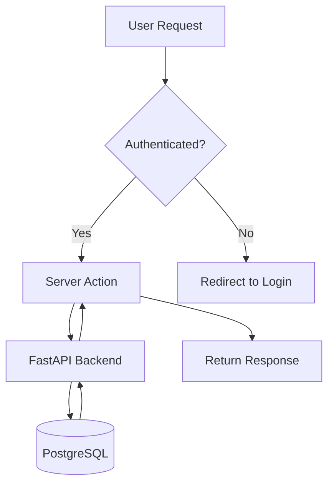

**Syntax:**
```
flowchart TD
    A[User Request] --> B{Authenticated?}
    B -->|Yes| C[Server Action]
    B -->|No| D[Redirect to Login]
    C --> E[FastAPI Backend]
    E --> F[(PostgreSQL)]
```

#### Sequence Diagrams

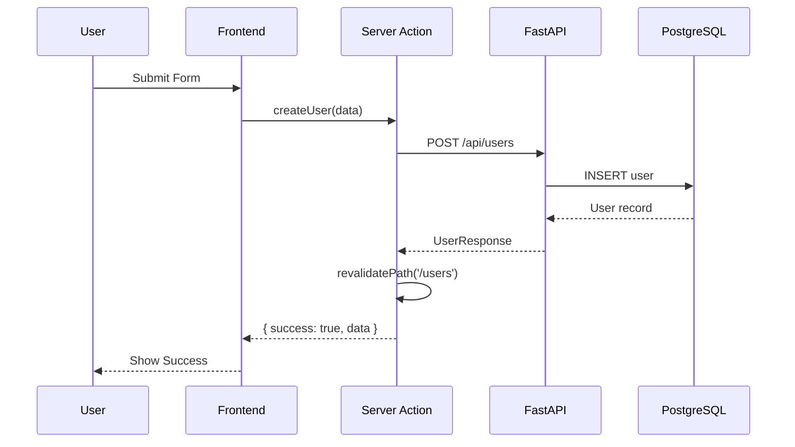

**Syntax:**
```
sequenceDiagram
    participant U as User
    participant F as Frontend
    U->>F: Submit Form
    F-->>U: Show Success
```

#### Entity Relationship Diagrams

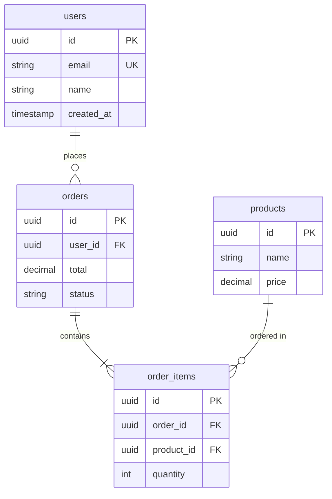

#### State Diagrams

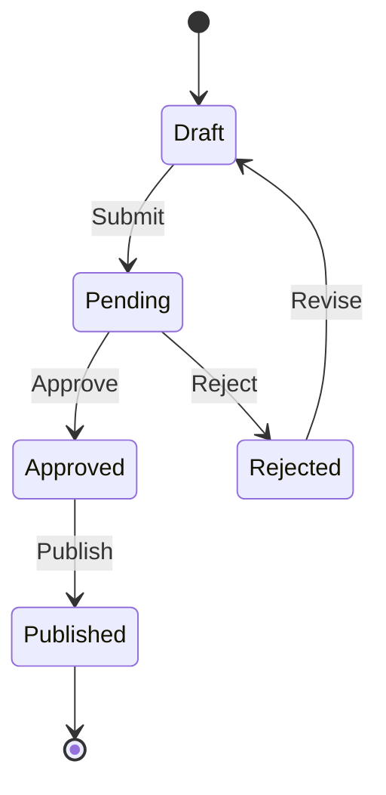

#### Architecture Diagrams (Simple)

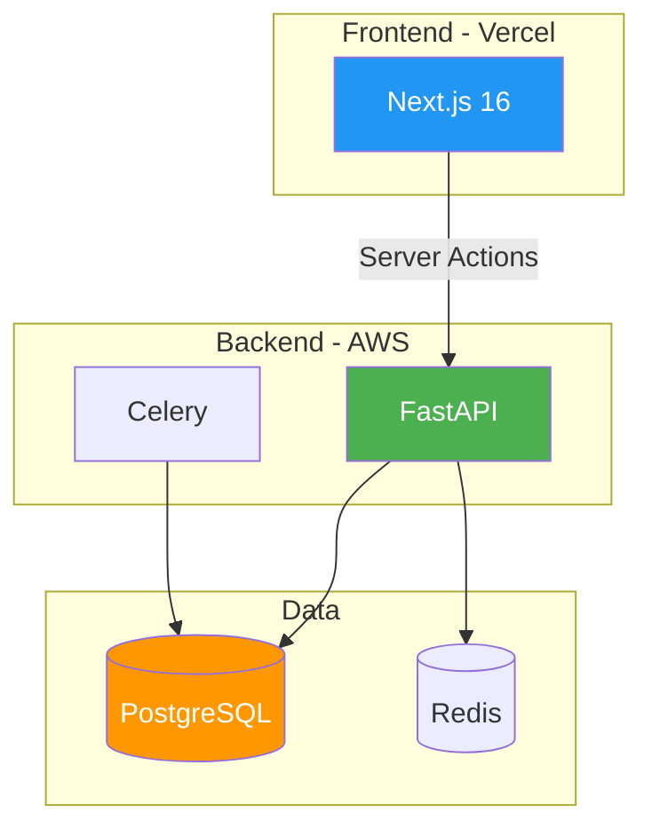

#### Class Diagrams (for API/Type structures)

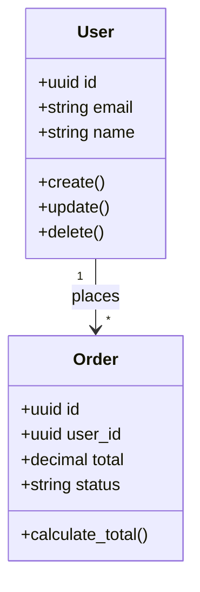

### Standalone Diagrams with Draw.io

Use Draw.io (`.drawio` files) for diagrams that:
- Are highly complex with many components
- Require precise positioning and custom styling
- Need to be exported as high-resolution images
- Contain sensitive details not suitable for plain text

#### File Organization

```
project/
├── docs/
│   ├── architecture/
│   │   ├── overview.md              # Contains inline Mermaid
│   │   └── diagrams/
│   │       ├── system-topology.drawio
│   │       ├── network-architecture.drawio
│   │       └── exports/             # PNG/SVG exports
│   │           ├── system-topology.png
│   │           └── network-architecture.svg
```

#### Naming Conventions for Draw.io Files

| Type | Pattern | Example |
|------|---------|---------|
| System diagrams | `system-{name}.drawio` | `system-topology.drawio` |
| Network diagrams | `network-{name}.drawio` | `network-architecture.drawio` |
| Flow diagrams | `flow-{process}.drawio` | `flow-user-registration.drawio` |
| Component diagrams | `component-{name}.drawio` | `component-auth-service.drawio` |

#### Draw.io Best Practices

1. **Version Control**: Commit `.drawio` files to version control
2. **Export Formats**: Export as both PNG (for docs) and SVG (for web)
3. **Consistent Styling**: Use a consistent color palette across diagrams
4. **Layered Design**: Use layers for different aspects (infrastructure, data, users)
5. **Embed in Docs**: Reference exported images in markdown:
   ```markdown
   
   ```

### VS Code Extensions for Diagrams

#### Required Extensions

| Extension | Purpose |
|-----------|---------|
| **Markdown Preview Mermaid Support** | Renders Mermaid in VS Code preview |
| **Draw.io Integration** | Edit `.drawio` files directly in VS Code |

#### Recommended Extensions

| Extension | Purpose |
|-----------|---------|
| **Mermaid Markdown Syntax Highlighting** | Syntax highlighting for Mermaid code blocks |
| **Markdown All in One** | Enhanced markdown editing with TOC support |

#### VS Code Settings

Add to `.vscode/settings.json`:
```json
{
  "markdown.mermaid.theme": "default",
  "hediet.vscode-drawio.theme": "Kennedy"
}
```

### When to Use Which Diagram Type

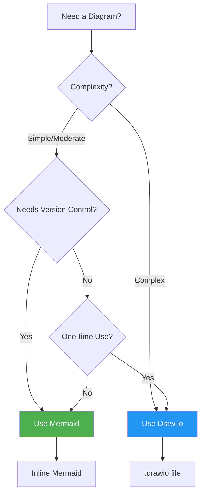

**Decision Guide:**

| Scenario | Recommendation |
|----------|----------------|
| Data flow between components | Mermaid sequence diagram |
| Database schema | Mermaid ER diagram |
| Simple architecture overview | Mermaid graph/flowchart |
| Complex multi-service topology | Draw.io |
| Network infrastructure with IP addresses | Draw.io |
| State machine for business logic | Mermaid state diagram |
| UI wireframes | Draw.io or Figma (not covered here) |

## Metadata Requirements

### Document Front Matter

Every standard document must include:

```markdown
# [Title]

**Version**: X.Y.Z (Semantic versioning)
**Last Updated**: YYYY-MM-DD
**Status**: Draft | In Review | Approved | Active | Deprecated
**Owner**: [Name - decision maker for this document]
**Reviewers**: [Names - who approved this document]
```

#### Optional Metadata (Recommended for Specifications)

```markdown
**Dependencies**: [Links to prerequisite documents]
**Related**: [Cross-reference related documents]
**Review Date**: YYYY-MM-DD [when to revisit]
```

### Document Status Lifecycle

Documents progress through these states:

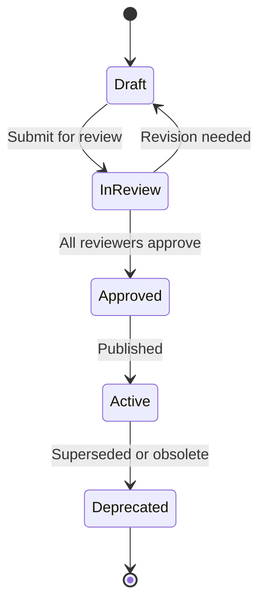

| Status | Meaning | Who Can Edit |
|--------|---------|--------------|
| **Draft** | Initial creation, incomplete | Author |
| **In Review** | Ready for stakeholder review | Author (for revisions) |
| **Approved** | Signed off, ready for use | Owner (with version bump) |
| **Active** | In use, published | Owner (with version bump) |
| **Deprecated** | Superseded or no longer applicable | Owner only |

### Version Control

Follow semantic versioning (MAJOR.MINOR.PATCH):

- **MAJOR**: Breaking changes or complete rewrites
- **MINOR**: New standards added, non-breaking changes
- **PATCH**: Clarifications, typos, formatting

## Cross-Referencing

### Internal Links

1. **Relative paths**: Use relative paths for internal links
   ```markdown
   See [Error Contract](../architecture/error-contract.md) for details.
   ```

2. **Section links**: Link to specific sections when relevant
   ```markdown
   See [Authentication Flow](../architecture/authentication.md#oauth-flow).
   ```

3. **Consistency**: Maintain a consistent linking style

### External Links

1. **Official docs**: Link to official documentation when available
2. **Stability**: Use version-specific links when possible
3. **Context**: Provide context for external links

## Maintenance

### Review Cycle

- **Quarterly**: Review all standards for accuracy
- **On technology updates**: Update when dependencies change
- **On team feedback**: Incorporate learnings and feedback

### Deprecation Process

1. Mark document status as "Deprecated"
2. Add deprecation notice at the top
3. Link to replacement standard
4. Set removal date (typically 6 months)
5. Update CHANGELOG.md

```markdown
> **⚠️ DEPRECATED**: This standard is deprecated as of YYYY-MM-DD.
> Use [New Standard](link) instead.
> This document will be removed on YYYY-MM-DD.
```

### Update Process

1. Create a branch for changes
2. Update the document(s)
3. Update version number
4. Add entry to CHANGELOG.md
5. Update "Last Updated" date
6. Create pull request for review

## Accessibility

### For Human Readers

1. **Clear hierarchy**: Use headings properly (H1 > H2 > H3)
2. **Table of contents**: Auto-generated or manual for long docs
3. **Search-friendly**: Use descriptive headings and keywords
4. **Print-friendly**: Ensure content works in print/PDF

### For AI Assistants

1. **Machine-readable index**: Maintain INDEX.md with structured data
2. **Consistent patterns**: Use predictable document structure
3. **Clear context**: Include purpose and scope sections
4. **Navigation aids**: Provide clear category mappings

## Quality Checklist

Before finalizing any standard document:

- [ ] Follows document structure template
- [ ] Includes proper metadata (version, date, status)
- [ ] Uses correct naming convention
- [ ] Contains clear examples (both good and bad)
- [ ] Has no broken internal links
- [ ] Uses consistent terminology
- [ ] Includes rationale for requirements
- [ ] Updated CHANGELOG.md
- [ ] Reviewed for clarity and completeness
- [ ] Proper markdown formatting
- [ ] Code examples are tested and correct

## Tools and Automation

### Recommended Tools

- **Linting**: markdownlint for markdown consistency
- **Link checking**: markdown-link-check for broken links
- **Spell check**: cspell or similar
- **Formatting**: Prettier with markdown plugin

### Git Hooks

Consider pre-commit hooks for:
- Markdown linting
- Link checking
- Ensuring CHANGELOG.md is updated
- Validating document structure

## Examples

### Good Directory Structure Example

```
backend/
├── README.md                 # Overview of backend standards
├── tech-stack.md            # Complete tech stack specification
├── python.md                # Python language conventions
├── error-handling.md        # Error handling patterns
└── testing.md               # Testing strategies
```

### Bad Directory Structure Example

```
backend/
├── readme.txt               # ❌ Wrong extension
├── BackendStack.md          # ❌ Wrong case
├── python_stuff.md          # ❌ Vague name, wrong case
├── API.md                   # ❌ Too generic
└── test-1.md               # ❌ Unclear, numbered
```

## Related Standards

- [Architecture Definition Standard](./architecture-definition.md) - Standard for creating project-specific architecture repositories
- [Discovery Standard](./discovery-standard.md) - Stakeholder interview and problem validation phase
- [Agentic Coding Standard](./agentic-coding-standard.md) - AI agent coding constraints and controls
- [Specification Standard](./specification-standard.md) - Feature specification creation
- [ADR Framework](../architecture/adr/README.md) - Architecture Decision Records

## References

- [Google Developer Documentation Style Guide](https://developers.google.com/style)
- [Microsoft Writing Style Guide](https://docs.microsoft.com/en-us/style-guide/)
- [Markdown Guide](https://www.markdownguide.org/)
- [Semantic Versioning](https://semver.org/)

## Revision History

| Version | Date       | Changes                    |
|---------|------------|----------------------------|
| 1.2.0   | 2026-01-03 | Enhanced metadata (Owner, Dependencies, Review Date), document lifecycle state diagram, related standards |
| 1.1.0   | 2025-12-30 | Added diagrams and visual documentation section (Mermaid + Draw.io standards) |
| 1.0.0   | 2024-11-10 | Initial documentation standard |

---

<!-- Source: standards/documentation/specification-standard.md (v1.0.0) -->

# Specification Standard

**Version**: 1.0.0
**Last Updated**: 2026-01-03
**Status**: Active
**Category**: Meta-Documentation

## Purpose

This standard defines how to create software specifications that bridge architecture documentation to implementation. Specifications ensure that features are well-defined before coding begins, enabling developers to implement correctly and QA to verify completely.

## Scope

- **Applies to**: New features, significant changes, API additions, external integrations
- **Not covered**: Bug fixes (unless scope is significant), minor UI tweaks, configuration changes
- **Workflow Position**: Discovery → BRD → PRD → Constitution → Architecture → ADRs → **Specifications** → Implementation → QA

## Relationship to Discovery Phase

### Discovery Before Specification

For new initiatives or unclear requirements, Discovery should precede specification:

1. **Discovery validates the problem** before detailed specification begins
2. **Discovery outputs** inform specification content (pain points → requirements)
3. **Stakeholder insights** from Discovery shape user stories and acceptance criteria

```markdown
**Discovery Reference**: DISC-XXX (if Discovery was conducted)
```

### When Discovery Precedes Specification

**Conduct Discovery first when**:
- New product or major initiative
- Problem statement is unclear or unvalidated
- Multiple stakeholders with different perspectives
- User needs are assumed, not verified

**Skip to Specification when**:
- Bug fixes with clear reproduction steps
- Technical improvements with defined scope
- Small enhancements where requirements are explicit
- Discovery already completed for parent initiative

See [Discovery Standard](./discovery-standard.md) for full Discovery guidance.

## Relationship to Business Requirements Document (BRD)

### BRD Before Specification

When a Business Requirements Document exists, specifications should:

1. **Reference the BRD**: Include BRD ID in specification header
2. **Trace Requirements**: Map business requirements (BR-XXX) to functional requirements (FR-XXX)
3. **Align Scope**: Specification scope should align with BRD scope

```markdown
**BRD Reference**: BRD-XXX (if applicable)

## Traceability to Business Requirements
| Business Requirement | Spec Requirement | Rationale |
|---------------------|------------------|-----------|
| BR-001 | FR-001, FR-002 | [How spec implements BR] |
```

### When to Create a BRD First

See [Business Requirements Standard](./business-requirements-standard.md) for guidance on when to create a BRD before specifications.

**Create BRD first when**:
- Business context is unclear
- Multiple stakeholders with different priorities
- Success metrics needed
- Significant investment (>2 weeks)

**Skip to Specification when**:
- Bug fixes with clear requirements
- Technical improvements
- Small enhancements with obvious requirements

## Relationship to Product Requirements Document (PRD)

### PRD Before Specification

When a Product Requirements Document exists, specifications should:

1. **Reference the PRD**: Include PRD ID in specification header
2. **Trace Features**: Map product features (FEAT-XXX) to functional requirements (FR-XXX)
3. **Reference User Stories**: Link functional requirements to user stories (US-XXX)

```markdown
**PRD Reference**: PRD-XXX (if applicable)
**BRD Reference**: BRD-XXX (if applicable)

## Traceability to Product Requirements
| Feature | User Stories | Spec Requirements |
|---------|--------------|-------------------|
| FEAT-001 | US-001, US-002 | FR-001, FR-002 |
| FEAT-002 | US-003 | FR-003, FR-004 |
```

### Complete Traceability Chain

```
BRD (BR-XXX) → PRD (FEAT-XXX, US-XXX) → Spec (FR-XXX) → Tests (IT-XXX)
```

### When PRD Precedes Specification

**PRD typically precedes specs when**:
- User personas and user stories are defined
- Product features need technical translation
- UX/design work has been completed
- Multiple features map to one specification

**Skip PRD when**:
- Technical-only changes
- API-only changes without user-facing impact
- Small enhancements with obvious requirements

See [Product Requirements Standard](./product-requirements-standard.md) for full PRD guidance.

## Relationship to Architecture Decision Records (ADRs)

### ADR Cross-References

Specifications must reference relevant ADRs when:

1. **Architectural decisions** affect the specification (technology choices, patterns)
2. **Trade-offs** were made that constrain the implementation
3. **Alternatives were rejected** that future readers should understand

```markdown
## Related ADRs

| ADR | Impact on This Specification |
|-----|------------------------------|
| [ADR-001](../architecture/adr/ADR-001-xxx.md) | Defines database choice |
| [ADR-003](../architecture/adr/ADR-003-xxx.md) | Establishes authentication pattern |
```

### When to Create a New ADR

If the specification requires a significant architectural decision not yet documented:

1. **Create the ADR first** in `architecture/adr/`
2. **Reference it** in the specification
3. **Get ADR approved** before specification approval

See [ADR Framework](../architecture/adr/README.md) for ADR creation guidance.

## QA Co-Authorship Requirement

### Test Scenarios Must Be QA Co-Authored

For Tier 1 and Tier 2 specifications, test scenarios should be co-authored with QA:

1. **QA reviews user stories** to identify edge cases
2. **QA contributes test scenarios** based on acceptance criteria
3. **QA signs off** on the specification's testability

```markdown
## Approval

| Role | Name | Date | Status |
|------|------|------|--------|
| Product Owner | | | Pending |
| Tech Lead | | | Pending |
| **QA Lead (Co-Author)** | | | Pending |
```

### Benefits of QA Co-Authorship

- **Shift-left testing**: Test scenarios defined before implementation
- **Reduced ambiguity**: QA perspective catches unclear requirements early
- **Better coverage**: Edge cases and error scenarios identified upfront
- **Faster verification**: QA ready to test immediately after implementation

### QA Involvement by Tier

| Tier | QA Co-Authorship | Test Scenario Depth |
|------|------------------|---------------------|
| Tier 1 (Full) | Required | Full test matrix, performance, security |
| Tier 2 (Standard) | Required | Key scenarios, happy/error paths |
| Tier 3 (Lightweight) | Recommended | Minimal scenarios, acceptance criteria |

## Agentic Coding Considerations

When AI agents generate or update specifications:

1. **Follow the Agentic Coding Standard** for quality constraints
2. **Reference source documents** (Discovery, PRD) explicitly
3. **Mark assumptions clearly** in the Assumptions & Ambiguities section
4. **Request QA review** for test scenarios

See [Agentic Coding Standard](./agentic-coding-standard.md) for agent-specific rules.

## Relationship to Other Documentation

```
┌─────────────────────────────────────────────────────────────┐
│   Standards Repository                                       │
│   - Generic patterns & best practices                        │
│   - This specification standard                              │
│   - Specification templates                                  │
└─────────────────────────────────────────────────────────────┘
                         ▲
                         │ References
                         │
┌─────────────────────────────────────────────────────────────┐
│   Project Architecture Repository                            │
│   project-name-architecture/                                 │
│   - System architecture & design                             │
│   - specifications/  ← PROJECT SPECS LIVE HERE               │
│       ├── features/                                          │
│       ├── api-contracts/                                     │
│       └── integrations/                                      │
└─────────────────────────────────────────────────────────────┘
                         │
                         │ Guides
                         ▼
┌─────────────────────────────────────────────────────────────┐
│   Project Codebase                                           │
│   project-name/                                              │
│   - Implementation (references spec IDs in code comments)    │
│   - Tests (mapped to spec acceptance criteria)               │
└─────────────────────────────────────────────────────────────┘
```

## Specification Tiers

Choose the appropriate tier based on feature complexity and risk:

| Tier | Name | When to Use | Effort |
|------|------|-------------|--------|
| **1** | Full | Major features, architectural changes, cross-team coordination, high-risk changes | 4-8 hours |
| **2** | Standard | Typical features, new API endpoints, moderate complexity | 1-4 hours |
| **3** | Lightweight | Small features, enhancements, bug fixes with significant scope | 30-60 min |

### Tier Selection Guide

```
Is this a major architectural change or new system component?
├── Yes → Tier 1 (Full)
└── No
    ├── Does it span multiple services or require cross-team coordination?
    │   ├── Yes → Tier 1 (Full)
    │   └── No
    │       ├── Is this a typical feature with frontend + backend changes?
    │       │   ├── Yes → Tier 2 (Standard)
    │       │   └── No
    │       │       ├── Is this an API-only change?
    │       │       │   ├── Yes → Tier 2 (API Contract)
    │       │       │   └── No → Tier 3 (Lightweight)
    │       └── Is this an external service integration?
    │           ├── Yes → Tier 2 (Integration)
    │           └── No → Tier 3 (Lightweight)
```

### Required Sections by Tier

| Section | Tier 1 | Tier 2 | Tier 3 |
|---------|--------|--------|--------|
| Overview & Problem Statement | Required | Required | Required |
| User Stories | Required | Required | Required |
| Acceptance Criteria (BDD) | Required | Required | Required |
| Functional Requirements | Required | Required | Optional |
| **Assumptions & Ambiguities** | Required | Required | Simplified |
| Non-Functional Requirements | Required | Required | Optional |
| Data Requirements | Required | Required | If applicable |
| API Contracts | Required | Required | If applicable |
| UI/UX Specifications | Required | Simplified | Optional |
| Edge Cases & Error Handling | Required | Required | Key cases only |
| Test Scenarios | Required | Required | Key scenarios |
| Dependencies | Required | Required | Required |
| Rollout Plan | Required | Optional | Not required |
| Monitoring | Required | Optional | Not required |
| Approval Sign-off | Required | Required | Required |

## Specification Types

### 1. Feature Specification

**Purpose**: Document end-to-end features spanning frontend and backend

**When to Use**:
- New user-facing functionality
- Features requiring UI, API, and database changes
- Cross-cutting concerns affecting multiple system areas

**Template**: `feature-spec.md` (single tiered template with tier markers)

### 2. API Contract Specification

**Purpose**: Document backend API endpoints with detailed contracts

**When to Use**:
- New API endpoints without significant frontend work
- API versioning or breaking changes
- Internal service-to-service APIs
- Public/partner API additions

**Template**: `api-contract-spec.md`

### 3. Integration Specification

**Purpose**: Document external service integrations

**When to Use**:
- Third-party API integrations
- Webhook implementations (inbound or outbound)
- External service replacements
- Message queue integrations

**Template**: `integration-spec.md`

### 4. Project Constitution

**Purpose**: Define governing principles and constraints for a project

**When to Use**:
- New project initialization
- When multiple teams work on the same project
- When architectural constraints need documentation
- When compliance requirements exist

**Template**: `project-constitution.md`

**Key Sections**:
- Architectural Principles (non-negotiable patterns)
- Performance Budgets (response times, resource limits)
- Scalability Constraints (load requirements, geographic distribution)
- Security Posture (authentication, data protection)
- Compliance Requirements (GDPR, HIPAA, SOC2)
- Testing Requirements (coverage targets, quality gates)
- Exception Process (how to request deviations)

**Usage**: Feature specifications should reference the project constitution. Deviations from constitutional requirements must follow the exception process documented in the constitution.

## Specification ID Convention

```
SPEC-[TYPE]-[NUMBER]
```

**Types**:
- `FEAT` - Feature specification
- `API` - API contract specification
- `INT` - Integration specification

**Examples**:
- `SPEC-FEAT-001` - User profile photo upload
- `SPEC-API-012` - Orders API v2
- `SPEC-INT-003` - Stripe payment integration

**Numbering**: Sequential within each type, padded to 3 digits.

## Core Sections

### 1. Overview

Every specification must start with:

```markdown
# [Feature Name] Specification

**Spec ID**: SPEC-[TYPE]-[NUMBER]
**Version**: 1.0.0
**Created**: YYYY-MM-DD
**Last Updated**: YYYY-MM-DD
**Status**: Draft | Review | Approved | Implemented | Deprecated
**Tier**: Full | Standard | Lightweight
**Author**: [Name]
**Reviewers**: [Names]

## Related Documentation
- **Architecture**: [Link to architecture doc]
- **Parent Epic/Story**: [Link to ticket]
- **Implementation PR**: [Link when available]
- **Test Plan**: [Link when available]
```

### 2. Problem Statement

Clearly articulate the problem being solved:

```markdown
## 1. Overview

### 1.1 Problem Statement
[2-3 sentences describing the problem from the user's perspective]

### 1.2 Goals
- [Goal 1 - what success looks like]
- [Goal 2]

### 1.3 Non-Goals
- [Explicitly excluded scope item 1]
- [Explicitly excluded scope item 2]

### 1.4 Success Metrics
| Metric | Target | Measurement |
|--------|--------|-------------|
| [Metric name] | [Target value] | [How it's measured] |
```

### 3. User Stories

Use the standard user story format with INVEST criteria validation:

```markdown
## 2. User Stories

### Story 1: [Title]
**As a** [user type]
**I want** [action/capability]
**So that** [benefit/value]

**Acceptance Criteria**:
```gherkin
Given [precondition]
When [action]
Then [expected result]
And [additional result]
```

**INVEST Assessment**:
- [ ] **I**ndependent - Can be developed separately
- [ ] **N**egotiable - Details can be discussed
- [ ] **V**aluable - Delivers user value
- [ ] **E**stimable - Team can estimate effort
- [ ] **S**mall - Fits in a sprint
- [ ] **T**estable - Has clear acceptance criteria
```

### 4. Functional Requirements

Number requirements and assign priority:

```markdown
## 3. Functional Requirements

### 3.1 [Requirement Category]

#### FR-001: [Requirement Title]
**Priority**: Must Have | Should Have | Could Have | Won't Have
**Description**: [Detailed description]
**Business Rule**: [If applicable]
**Validation**: [How to verify this requirement is met]
```

**Priority Levels (MoSCoW)**:
- **Must Have**: Critical for release, non-negotiable
- **Should Have**: Important but not critical, can be deferred
- **Could Have**: Nice to have, low priority
- **Won't Have**: Explicitly excluded from this release

### 4.1 Assumptions & Ambiguities

Track requirement confidence levels to prevent implementation of unvalidated requirements:

```markdown
### 3.x Assumptions & Ambiguities

#### Confirmed Decisions (✓)
| Decision | Rationale | Confirmed By | Date |
|----------|-----------|--------------|------|
| [Decision] | [Why] | [Stakeholder] | [Date] |

#### Under Discussion (?)
| Topic | Options | Stakeholder | ETA | Impact if Delayed |
|-------|---------|-------------|-----|-------------------|
| [Topic] | [Options] | [Who] | [When] | [Blocks what] |

#### Blockers (⚠️)
| Blocker | Impact | Mitigation | Owner | Status |
|---------|--------|------------|-------|--------|
| [Blocker] | [What can't proceed] | [Workaround] | [Owner] | [Status] |

#### Key Assumptions
- [ ] [Assumption that, if wrong, requires spec revision]
```

**Why This Section Matters**:
- Prevents implementation of unconfirmed requirements
- Tracks pending decisions with stakeholder ownership
- Documents blockers for visibility
- Records assumptions that may invalidate the spec if wrong

**Confidence Markers**:
- **✓ Confirmed**: Requirement is finalized, approved to implement
- **? Under Discussion**: Options being considered, not yet decided
- **⚠️ Blocked**: External dependency preventing progress

### 5. Non-Functional Requirements

```markdown
## 4. Non-Functional Requirements

### 4.1 Performance
| Requirement | Target | Measurement |
|-------------|--------|-------------|
| Response time | < 200ms | API latency p95 |
| Throughput | 100 req/s | Load test |

### 4.2 Security
- [ ] Authentication required (method: [Clerk/JWT/API Key])
- [ ] Authorization rules: [Describe who can do what]
- [ ] Data sensitivity: [Public/Internal/Confidential/Restricted]
- [ ] Input validation: [Approach]

### 4.3 Accessibility
- WCAG 2.1 AA compliance
- Screen reader support
- Keyboard navigation

### 4.4 Scalability
- Expected load: [X users/day]
- Data growth: [X records/month]
```

### 6. Data Requirements

```markdown
## 5. Data Requirements

### 5.1 Data Model Changes

#### New Tables
```sql
CREATE TABLE [table_name] (
    id SERIAL PRIMARY KEY,
    [column_name] [type] [constraints],
    created_at TIMESTAMP NOT NULL DEFAULT NOW(),
    updated_at TIMESTAMP NOT NULL DEFAULT NOW()
);
```

#### Modified Tables
| Table | Change | Migration Notes |
|-------|--------|-----------------|
| [table] | [change] | [notes] |

### 5.2 Data Validation Rules
| Field | Rule | Error Message |
|-------|------|---------------|
| [field] | [rule] | [message] |

### 5.3 Data Relationships
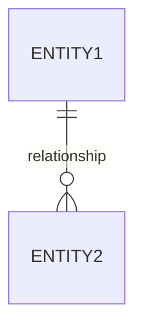
```

### 7. API Contracts

```markdown
## 6. API Contracts

### 6.1 New Endpoints

#### POST /api/v1/[resource]
**Purpose**: [Brief description]
**Authentication**: Required (Bearer token)
**Authorization**: [Role requirements]

**Request**:
```json
{
  "field1": "string (required, min: 2, max: 100)",
  "field2": "integer (optional, min: 0)"
}
```

**Response (201 Created)**:
```json
{
  "id": 1,
  "field1": "value",
  "created_at": "2025-01-15T10:00:00Z"
}
```

**Error Responses**:
| Status | Condition | Response |
|--------|-----------|----------|
| 400 | Validation error | `{"error": "...", "field_errors": [...]}` |
| 401 | Unauthenticated | `{"error": "Unauthorized"}` |
| 403 | Unauthorized | `{"error": "Forbidden"}` |
| 404 | Not found | `{"error": "Resource not found"}` |

### 6.2 Server Actions

```typescript
// Action: create[Feature]
// File: app/actions/[feature].ts

interface Input {
  field1: string;  // min: 2, max: 100
  field2?: number; // optional, min: 0
}

interface Output {
  success: boolean;
  data?: { id: number; field1: string; };
  error?: string;
  errors?: Array<{ field: string; message: string; }>;
}
```
```

### 8. Test Scenarios

```markdown
## 9. Test Scenarios

### 9.1 Unit Tests
| ID | Scenario | Input | Expected Output |
|----|----------|-------|-----------------|
| UT-001 | [Scenario] | [Input] | [Output] |

### 9.2 Integration Tests
| ID | Scenario | Preconditions | Steps | Expected Result |
|----|----------|---------------|-------|-----------------|
| IT-001 | [Scenario] | [Preconditions] | [Steps] | [Result] |

### 9.3 E2E Tests
```gherkin
Feature: [Feature Name]

  Scenario: [Scenario Name]
    Given [context]
    When [action]
    Then [expected result]
```
```

### 9. Approval

```markdown
## Approval

| Role | Name | Date | Status |
|------|------|------|--------|
| Product Owner | | | Pending |
| Tech Lead | | | Pending |
| QA Lead | | | Pending |
```

## Specification Workflow

### Status Lifecycle

```
Draft → Review → Approved → Implemented → Deprecated
          ↓
       Revision (back to Draft)
```

**Status Definitions**:
- **Draft**: Initial creation, incomplete
- **Review**: Ready for stakeholder review
- **Approved**: Signed off, ready for implementation
- **Implemented**: Feature is live in production
- **Deprecated**: Superseded or no longer applicable

### Workflow Steps

1. **Create Spec**
   - Select appropriate tier and template
   - Fill in all required sections
   - Set status to "Draft"

2. **Internal Review**
   - Author self-reviews for completeness
   - Peer developer reviews technical feasibility
   - Update status to "Review"

3. **Stakeholder Approval**
   - Product Owner reviews requirements
   - Tech Lead reviews technical approach
   - QA Lead reviews testability
   - All sign off in Approval section
   - Update status to "Approved"

4. **Implementation**
   - Developer references spec during coding
   - Code comments include spec ID
   - PRs reference spec document
   - Update spec with Implementation PR link

5. **Verification**
   - QA uses acceptance criteria for test cases
   - Tests reference spec IDs
   - Update status to "Implemented" when deployed

6. **Maintenance**
   - Update spec if requirements change
   - Increment version number
   - Add to revision history
   - Set to "Deprecated" if superseded

## Traceability

### Requirements to Code

Reference spec IDs in code comments:

```python
# Python (FastAPI)
class PhotoUpload(Base):
    """
    Photo upload model.

    Spec Reference:
        - Spec: SPEC-FEAT-003 Section 5.1
        - Requirements: FR-001, FR-002
    """
```

```typescript
// TypeScript (Server Actions)
/**
 * Upload user profile photo
 *
 * @spec SPEC-FEAT-003
 * @requirements FR-001, FR-002, NFR-001
 * @acceptance AC-001, AC-002
 */
export async function uploadProfilePhoto(...)
```

### Traceability Matrix

Maintain in each spec:

```markdown
## Traceability Matrix

| Requirement | Implementation | Test Case | Status |
|-------------|----------------|-----------|--------|
| FR-001 | app/models/photo.py | UT-001, IT-001 | Implemented |
| FR-002 | app/actions/photos.ts | IT-002 | Implemented |
```

## File Organization

### In Architecture Repository

```
project-name-architecture/
├── specifications/
│   ├── README.md                    # Index and status tracking
│   ├── features/
│   │   ├── SPEC-FEAT-001-user-registration.md
│   │   ├── SPEC-FEAT-002-profile-management.md
│   │   └── SPEC-FEAT-003-photo-upload.md
│   ├── api-contracts/
│   │   ├── SPEC-API-001-users-api.md
│   │   └── SPEC-API-002-photos-api.md
│   └── integrations/
│       └── SPEC-INT-001-image-processing.md
└── ... (other architecture folders)
```

### Spec File Naming

```
SPEC-[TYPE]-[NUMBER]-[kebab-case-name].md
```

Examples:
- `SPEC-FEAT-001-user-registration.md`
- `SPEC-API-012-orders-api-v2.md`
- `SPEC-INT-003-stripe-payments.md`

## Best Practices

### Do

- **Start with User Stories**: Begin every spec with who benefits and why
- **Be Specific**: Include concrete examples, not vague descriptions
- **Define Acceptance Criteria**: Every story needs testable criteria
- **Number Requirements**: Enable traceability with FR-XXX numbering
- **Include Error Cases**: Document what happens when things go wrong
- **Show Data Contracts**: Explicit JSON schemas, not prose descriptions
- **Version the Spec**: Track changes with semantic versioning
- **Get Sign-off**: Don't implement without approval

### Don't

- **Don't Skip Non-Goals**: Explicitly state what's out of scope
- **Don't Assume Context**: Write for someone unfamiliar with the project
- **Don't Over-Specify UI**: Focus on behavior, not pixel-perfect layouts
- **Don't Forget Performance**: Include NFRs from the start
- **Don't Write Novels**: Be concise; use tables and lists
- **Don't Delay Testing**: Write test scenarios during spec, not after
- **Don't Ignore Edge Cases**: They always become production bugs
- **Don't Gold-Plate**: Match spec detail to feature complexity (use tiers)

## Examples

### Good Example: User Story with Acceptance Criteria

```markdown
### Story 1: Upload Profile Photo
**As a** registered user
**I want** to upload my profile photo
**So that** my account is personalized and recognizable

**Acceptance Criteria**:
```gherkin
Given I am logged into my account
And I am on my profile settings page
When I click "Upload Photo" button
And I select a valid image file (JPG, PNG, WebP under 5MB)
Then the image is uploaded successfully
And my profile displays the new photo
And a success notification appears

Given I am logged into my account
When I try to upload a file larger than 5MB
Then I see an error message "Image must be smaller than 5MB"
And the file is not uploaded
```

**INVEST Assessment**:
- [x] Independent - Can be developed without other profile features
- [x] Negotiable - File types and size limits can be discussed
- [x] Valuable - Users want personalized profiles
- [x] Estimable - Team estimates 5 story points
- [x] Small - Fits in one sprint
- [x] Testable - Clear acceptance criteria above
```

### Bad Example: Vague Requirements

```markdown
### Story 1: Photo Upload
**As a** user
**I want** to upload photos
**So that** they are saved

**Acceptance Criteria**:
- Photos should upload
- Errors should be handled
```

**Why it's bad**:
- User type is vague ("user" vs "registered user")
- No specific file constraints
- No testable acceptance criteria
- No error scenarios defined
- INVEST not assessed

## Checklist

Before marking a spec as "Review":

- [ ] Spec ID assigned following convention
- [ ] All required sections for tier are complete
- [ ] User stories follow "As a... I want... So that..." format
- [ ] Acceptance criteria use Given/When/Then format
- [ ] INVEST criteria assessed for each story
- [ ] Requirements numbered (FR-XXX)
- [ ] Requirements prioritized (MoSCoW)
- [ ] Non-functional requirements specified
- [ ] Data model changes documented
- [ ] API contracts include request/response schemas
- [ ] Error cases documented
- [ ] Test scenarios cover acceptance criteria
- [ ] Dependencies identified
- [ ] Related documentation linked
- [ ] Version set to 1.0.0 (or incremented)

## Related Standards

- [Discovery Standard](./discovery-standard.md) - Stakeholder interview phase (precedes BRD/PRD)
- [Business Requirements Standard](./business-requirements-standard.md) - BRD standard (precedes PRD/specs)
- [Product Requirements Standard](./product-requirements-standard.md) - PRD standard (precedes specs)
- [Agentic Coding Standard](./agentic-coding-standard.md) - AI agent constraints
- [ADR Framework](../architecture/adr/README.md) - Architecture Decision Records
- [Documentation Standard](./documentation-standard.md) - General documentation guidelines
- [Architecture Definition Standard](./architecture-definition.md) - Project architecture documentation
- [API Design](../backend/python.md) - Backend API patterns
- [Server Actions](../frontend/server-actions.md) - Frontend data flow patterns
- [Database Naming](../database/naming-conventions.md) - Database conventions

## References

- [IEEE 830-1998](https://standards.ieee.org/standard/830-1998.html) - Software Requirements Specification
- [Behavior-Driven Development](https://cucumber.io/docs/bdd/) - BDD with Cucumber/Gherkin
- [User Stories Applied](https://www.mountaingoatsoftware.com/books/user-stories-applied) - Mike Cohn
- [INVEST Criteria](https://www.agilealliance.org/glossary/invest/) - Agile Alliance
- [MoSCoW Prioritization](https://www.productplan.com/glossary/moscow-prioritization/) - ProductPlan

## Revision History

| Version | Date | Author | Changes |
|---------|------|--------|---------|
| 1.2.0 | 2026-01-03 | Standards Team | Discovery phase integration, ADR cross-references, QA co-authorship, Agentic coding considerations |
| 1.1.0 | 2025-12-30 | Standards Team | Added Project Constitution template, Assumptions & Ambiguities section |
| 1.0.0 | 2025-12-30 | Standards Team | Initial specification standard |

---

<!-- Source: standards/documentation/agentic-coding-standard.md (v1.0.0) -->

# Agentic Coding Standard

**Version**: 1.0.0
**Last Updated**: 2026-01-03
**Status**: Active
**Owner**: Engineering Lead
**Dependencies**: [Project Constitution](../templates/specifications/project-constitution.md)

---

## Purpose

This standard defines rules and constraints for AI agents (LLMs, coding assistants) when generating, modifying, or reviewing code within projects that follow these standards. It ensures AI-assisted development produces consistent, safe, and maintainable output.

These rules should be referenced in:
- Project CLAUDE.md files
- Project Constitution documents
- CI/CD validation pipelines

---

## Source-of-Truth Hierarchy

When generating or modifying code, agents must respect this precedence order:

| Priority | Source | Overrides |
|----------|--------|-----------|
| 1 | **Project Constitution** | All below |
| 2 | **PRD / Specifications** | Code, comments |
| 3 | **Architecture Documentation** | Implementation details |
| 4 | **ADRs (Architecture Decision Records)** | Related implementations |
| 5 | **Existing Code Patterns** | New implementations |
| 6 | **Code Comments / TODOs** | Nothing |

### Conflict Resolution

When sources conflict:
1. Higher-priority source wins
2. If same priority, ask the user for clarification
3. Document the conflict and resolution in the output
4. Never silently override documented decisions

---

## Protected Paths

Agents must NOT modify these paths without explicit user confirmation:

### Always Protected (Never Auto-Modify)

```
# Database
alembic/versions/          # Migration files
migrations/                # Any migration directory
*.sql                      # Raw SQL files (review only)

# Authentication & Security
**/auth/                   # Authentication modules
**/security/               # Security modules
**/*secret*                # Anything named secret
**/*credential*            # Credential files
.env*                      # Environment files
**/keys/                   # Cryptographic keys

# Billing & Financial
**/billing/                # Billing modules
**/payment/                # Payment processing
**/stripe/                 # Payment provider integrations

# Infrastructure
*.tf                       # Terraform files
*.tfvars                   # Terraform variables
docker-compose.prod.yml    # Production compose
kubernetes/*.yaml          # K8s manifests (prod)

# CI/CD
.github/workflows/         # GitHub Actions
.gitlab-ci.yml             # GitLab CI
Jenkinsfile                # Jenkins pipelines
```

### Conditionally Protected (Warn Before Modify)

```
# Configuration
pyproject.toml             # Python project config
package.json               # Node project config
tsconfig.json              # TypeScript config
next.config.js             # Next.js config

# Lock Files
uv.lock                    # Python dependencies
package-lock.json          # Node dependencies
yarn.lock                  # Yarn dependencies

# Tests (warn on deletion)
tests/                     # Test directories
**/*.test.*                # Test files
**/*.spec.*                # Spec files
```

---

## Security Constraints

### Never Include in Generated Code

```python
# NEVER generate code that:
- Hardcodes secrets, API keys, or passwords
- Logs sensitive data (passwords, tokens, PII)
- Disables security features (CSRF, CORS, auth checks)
- Uses deprecated cryptographic algorithms
- Bypasses input validation
- Contains SQL injection vulnerabilities
- Contains XSS vulnerabilities
- Exposes internal error details to users
```

### Required Security Patterns

```python
# ALWAYS use these patterns:
- Environment variables for secrets
- Parameterized queries for database access
- Input validation at system boundaries
- Output encoding for user-displayed data
- Secure defaults (deny by default)
- Approved cryptographic libraries only
```

### Approved Cryptographic Libraries

| Language | Approved Libraries |
|----------|-------------------|
| Python | `cryptography`, `bcrypt`, `argon2-cffi` |
| TypeScript | `crypto` (Node.js built-in), `bcryptjs` |
| Hashing | bcrypt, argon2 (NEVER MD5, SHA1 for passwords) |
| Encryption | AES-256-GCM (NEVER ECB mode) |

---

## Quality Gates

Agents must verify these conditions before considering work complete:

### Code Quality

- [ ] Code passes linting (`ruff check`, `eslint`)
- [ ] Code passes formatting (`ruff format`, `prettier`)
- [ ] TypeScript has no type errors (`tsc --noEmit`)
- [ ] Python has type hints on all public functions
- [ ] No `any` types in TypeScript (except explicit escape hatches)
- [ ] No `TODO` comments without ticket reference (e.g., `# TODO(FEAT-001): ...`)
- [ ] No `console.log` / `print` debugging statements
- [ ] No commented-out code blocks

### Testing

- [ ] Unit tests exist for new functions
- [ ] Tests pass locally
- [ ] Test coverage meets threshold (typically 80%+)
- [ ] Edge cases are tested
- [ ] Error cases are tested

### Documentation

- [ ] Public APIs have docstrings
- [ ] Complex logic has inline comments
- [ ] Breaking changes documented
- [ ] CHANGELOG updated if applicable

---

## Verification Discipline

For non-trivial changes, agents must produce:

### 1. Test Plan

Before implementing, document:
- What will be tested
- How it will be tested
- Edge cases to cover
- Performance considerations

### 2. Negative Cases

Always implement handling for:
- Invalid input
- Missing data
- Network failures
- Timeout scenarios
- Permission denied
- Resource not found

### 3. Rollback Plan

For data-affecting changes:
- How to revert the change
- Data migration rollback steps
- Feature flag to disable

---

## Prompt/Context Hygiene

### Required Context Before Generating

Agents should request or verify they have:

| Context Type | Required For |
|--------------|--------------|
| Project Constitution | Any code generation |
| Relevant ADRs | Architectural decisions |
| Existing patterns | New implementations |
| Test patterns | Test generation |
| Error handling patterns | Error-prone code |
| Specification/PRD | Feature implementations |

### Context Loading Order

```
1. CLAUDE.md (project-specific instructions)
2. Relevant specification or PRD section
3. Related existing code files
4. Test patterns for similar features
5. Architecture documentation (if architectural change)
```

---

## Code Generation Guidelines

### Prefer

```
- Editing existing files over creating new ones
- Following existing patterns over introducing new ones
- Minimal changes that solve the problem
- Self-documenting code with clear naming
- Composition over inheritance
- Explicit over implicit
- Simple over clever
```

### Avoid

```
- Over-engineering (features not requested)
- Premature abstraction (wait for 3+ duplications)
- Adding dependencies without justification
- Changing unrelated code ("while I'm here...")
- Breaking backwards compatibility silently
- Magic numbers without constants
- Deep nesting (max 3 levels)
```

---

## Error Handling Requirements

### Backend (Python/FastAPI)

```python
# Required: Use appropriate HTTP status codes
raise HTTPException(
    status_code=status.HTTP_404_NOT_FOUND,
    detail="Resource not found"  # User-safe message
)

# Required: Log internal details, don't expose
logger.error(f"Database error: {internal_error}")
raise HTTPException(
    status_code=500,
    detail="Internal server error"  # Generic message
)
```

### Frontend (TypeScript/React)

```typescript
// Required: Use ActionResult pattern
interface ActionResult<T> {
  success: boolean;
  data?: T;
  error?: string;
  errors?: Array<{ field: string; message: string }>;
}

// Required: Handle all error states in UI
if (result.error) {
  // Show user-friendly error
}
```

---

## Commit Message Requirements

When generating commit messages:

```
Format: [ID] type: description

Where:
- ID = FEAT-XXX, FR-XXX, or BUG-XXX
- type = feat, fix, refactor, test, docs, chore
- description = imperative mood, lowercase

Examples:
[FEAT-001] feat: add user authentication flow
[FR-042] fix: handle null pointer in payment processing
[BUG-123] fix: resolve race condition in cache invalidation
```

---

## PR Title Format

```
[ID] Description

Examples:
[FEAT-001] Add user authentication with Clerk
[FR-042] Fix payment processing null pointer
[BUG-123] Resolve cache race condition
```

---

## Test Naming Requirements

```python
# Python: test_{what}_{when}_{expected}
def test_create_user_with_valid_data_returns_user():
    pass

def test_create_user_with_duplicate_email_raises_conflict():
    pass
```

```typescript
// TypeScript: describe/it pattern with IDs
describe('UserService [FEAT-001]', () => {
  it('[IT-001] creates user with valid data', () => {});
  it('[IT-002] throws on duplicate email', () => {});
});
```

---

## CLAUDE.md Template Section

Add this section to project CLAUDE.md files:

```markdown
## Agentic Coding Controls

This project follows the [Agentic Coding Standard](path/to/standards/documentation/agentic-coding-standard.md).

### Source of Truth (This Project)
1. PROJECT-CONSTITUTION.md
2. specifications/*.md
3. Existing code patterns

### Protected Paths (This Project)
- `alembic/versions/` - Never modify without explicit request
- `app/core/security/` - Security-critical, require review
- `app/billing/` - Financial, require review

### Project-Specific Rules
- [Add any project-specific agent rules here]
```

---

## CI/CD Validation

Implement these checks in CI pipelines:

### Required Checks

```yaml
# Example GitHub Actions snippet
- name: Validate Traceability
  run: |
    # Ensure PR title has ID
    if ! echo "$PR_TITLE" | grep -qE '^\[FEAT-[0-9]+\]|^\[FR-[0-9]+\]|^\[BUG-[0-9]+\]'; then
      echo "PR title must start with [FEAT-XXX], [FR-XXX], or [BUG-XXX]"
      exit 1
    fi

- name: Check No TODO Without Ticket
  run: |
    # Ensure TODOs have ticket references
    if grep -rn 'TODO' --include='*.py' --include='*.ts' | grep -v 'TODO('; then
      echo "TODOs must include ticket reference: TODO(FEAT-XXX)"
      exit 1
    fi

- name: Protected Path Check
  run: |
    # Warn if protected paths modified
    PROTECTED="alembic/versions|security|billing|payment"
    if git diff --name-only HEAD~1 | grep -E "$PROTECTED"; then
      echo "WARNING: Protected paths modified - requires additional review"
    fi
```

---

## Exceptions Process

When an agent needs to deviate from these standards:

1. **Document the reason** in the code comment
2. **Reference the exception** in PR description
3. **Get explicit approval** from code owner
4. **Add to tech debt tracker** if temporary

```python
# EXCEPTION(AGENTIC-SECURITY): Using MD5 for legacy system compatibility
# Approved by: @security-lead on 2026-01-03
# Ticket: TECH-DEBT-042
# Planned remediation: FEAT-099
import hashlib  # noqa: S303
```

---

## Related Documents

- [Project Constitution Template](../templates/specifications/project-constitution.md)
- [Development Workflow](../devops/development-workflow.md)
- [Security Architecture](../architecture/security.md)
- [Testing Strategy](../architecture/testing-strategy.md)
- [Documentation Standard](./documentation-standard.md)
- [Specification Standard](./specification-standard.md)

---

*Part of the Standards Documentation Repository*

---

<!-- Source: standards/documentation/architecture-definition.md (v1.0.1) -->

# Architecture Definition Standard

**Version**: 1.0.1
**Last Updated**: 2025-12-30
**Status**: Active
**Category**: Meta-Documentation

## Purpose

This standard defines how to create and maintain **project-specific architecture documentation** for web applications. Projects use a **multi-repository pattern** with centralized documentation in the repos directory.

## Scope

- **Applies to**: New greenfield web application projects
- **Architecture Type**: Full-stack web applications following our [frontend tech stack standards](../frontend/tech-stack.md), [backend tech stack standards](../backend/tech-stack.md), and [architecture patterns](../architecture/README.md)
- **Not covered**: Mobile applications, legacy system documentation, embedded systems

## Multi-Repository Pattern (Recommended)

Projects follow a **3-location structure**:

```
┌─────────────────────────────────────────────────────────┐
│   Standards Repository (standards/)                      │
│   - Generic patterns & best practices                    │
│   - Tech stack specifications                            │
│   - Coding conventions                                   │
│   - Project documentation templates                      │
└─────────────────────────────────────────────────────────┘
                    ▲
                    │ References
                    │
┌─────────────────────────────────────────────────────────┐
│   Project Documentation (repos/{project-name}/)          │
│   - Project-specific architecture                        │
│   - Task tracking & implementation plans                 │
│   - Feature specifications                               │
│   - Technology decisions & rationale                     │
└─────────────────────────────────────────────────────────┘
                    │
                    │ Guides Implementation
                    ▼
┌───────────────────────────┬─────────────────────────────┐
│   Frontend Repository     │   Backend Repository         │
│   {project-name}-frontend │   {project-name}-backend     │
│   - Next.js application   │   - FastAPI application      │
│   - React components      │   - SQLAlchemy models        │
│   - Server actions        │   - Database migrations      │
└───────────────────────────┴─────────────────────────────┘
```

## Documentation Location

Project documentation lives in the repos directory, **not in a separate architecture repository**:

```
repos/
├── standards/                     # Generic standards (this repo)
└── {project-name}/                # Project-specific documentation
    ├── README.md                  # Project hub
    ├── CLAUDE.md                  # AI agent instructions
    ├── task-tracker.md            # Sprint-based task tracking
    ├── implementation-plan.md     # Phased implementation
    ├── development-workflow.md    # Project workflow
    ├── specifications/            # Feature specifications
    └── architecture/              # Architecture documentation
```

## Naming Conventions

### Project Documentation Folder
```
repos/{project-name}/
```

### Code Repositories
```
{project-name}-frontend/
{project-name}-backend/
```

### Examples
- `repos/cv-platform/` (documentation)
- `cv-platform-frontend/` (Next.js code)
- `cv-platform-backend/` (FastAPI code)

### Rules
- Use kebab-case (lowercase with hyphens)
- Include descriptive project name
- Frontend repo ends with `-frontend`
- Backend repo ends with `-backend`
- Avoid abbreviations unless widely understood

## Project Documentation Structure

The project documentation folder (`repos/{project-name}/`) contains:

```
repos/{project-name}/
├── README.md                          # Project hub & navigation
├── CLAUDE.md                          # AI agent instructions
├── CHANGELOG.md                       # Project version history
├── task-tracker.md                    # Sprint-based task tracking
├── implementation-plan.md             # Phased implementation
├── development-workflow.md            # Project-specific workflow
│
├── specifications/                    # Feature & API specifications
│   ├── README.md                     # Spec index and status tracking
│   ├── SPEC-FEAT-001-example.md      # Feature specifications
│   ├── SPEC-API-001-example.md       # API contract specifications
│   └── SPEC-INT-001-example.md       # Integration specifications
│
└── architecture/                      # Architecture documentation
    ├── overview.md                   # System architecture overview
    ├── data-flow.md                  # Data flow patterns
    ├── security.md                   # Security architecture
    ├── database.md                   # Schema & ER diagrams
    └── deployment.md                 # Deployment architecture
```

## Code Repository Structures

### Frontend Repository (`{project-name}-frontend/`)

```
{project-name}-frontend/
├── README.md
├── package.json
├── src/
│   ├── app/                          # App Router pages & actions
│   ├── components/                   # React components
│   │   ├── ui/                       # Shadcn/ui components
│   │   └── features/                 # Feature components
│   ├── lib/                          # Utilities & configurations
│   ├── types/                        # TypeScript types
│   └── hooks/                        # Custom React hooks
├── tests/                            # Test files
└── .github/workflows/                # CI/CD for frontend
```

### Backend Repository (`{project-name}-backend/`)

```
{project-name}-backend/
├── README.md
├── pyproject.toml
├── app/
│   ├── api/routers/                  # FastAPI route handlers
│   ├── models/                       # SQLAlchemy models
│   ├── schemas/                      # Pydantic schemas
│   ├── crud/                         # CRUD operations
│   ├── services/                     # Business logic
│   └── core/                         # Core configurations
├── alembic/                          # Database migrations
├── tests/                            # Test files
└── .github/workflows/                # CI/CD for backend
```

## Document Structure Template

Every architecture document should follow this structure:

```markdown
# [Document Title]

**Version**: X.Y.Z
**Last Updated**: YYYY-MM-DD
**Status**: Draft | Active | Deprecated
**Related Standards**: [Links to standards repository]

## Overview

Brief description of what this document covers (2-3 sentences).

## [Section 1]

Content with proper headings...

### Subsection

Content...

## Diagrams

[Include Mermaid diagrams where appropriate]

## Implementation Notes

Specific implementation details, constraints, or considerations.

## Related Documentation

- [Link to related architecture docs]
- [Link to standards repository sections]

---
*Part of [Project Name] Architecture Documentation*
```

## Versioning

### Semantic Versioning for Architecture

Architecture documentation uses semantic versioning independent from the application:

```
MAJOR.MINOR.PATCH

Example: 2.3.1
```

**Version Components:**

| Component | When to Increment | Example |
|-----------|------------------|---------|
| **MAJOR** | Breaking architectural changes, major technology changes, complete redesigns | Migrating from monolith to microservices, changing primary database |
| **MINOR** | New major components, significant feature architecture, database schema additions | Adding new service, new database tables, new API modules |
| **PATCH** | Documentation updates, clarifications, diagram improvements, minor corrections | Fixing typos, updating diagrams, clarifying existing patterns |

### When to Update Architecture Documentation

| Change Type | Version Update | Documentation Update Required |
|-------------|---------------|------------------------------|
| New database table | MINOR | Update database/schema-overview.md, create table doc |
| New API endpoint | MINOR | Update api/endpoints/, update api/overview.md |
| New third-party service | MINOR | Update technology-stack/third-party-services.md |
| Major technology change | MAJOR | Update all affected sections, add rationale |
| Security pattern change | MINOR or MAJOR | Update security/ section, update system diagrams |
| Documentation clarification | PATCH | Update specific document only |
| Diagram improvement | PATCH | Update diagram, note in CHANGELOG |
| Infrastructure change | MINOR or MAJOR | Update infrastructure/, deployment.md |

### CHANGELOG.md Format

```markdown
# Architecture Changelog

All notable changes to this architecture will be documented in this file.

The format is based on [Keep a Changelog](https://keepachangelog.com/en/1.0.0/),
and this project adheres to [Semantic Versioning](https://semver.org/spec/v2.0.0.html).

## [Unreleased]

### Planned
- Feature architecture planning

## [2.1.0] - 2025-02-15

### Added
- Payment processing service integration
- New orders API endpoints
- Redis caching layer for product catalog

### Changed
- Updated authentication flow to support OAuth2
- Revised database indexing strategy

### Technical Details
- New tables: `payment_transactions`, `payment_methods`
- New service: Payment Gateway (Stripe)
- Updated: api/endpoints/orders-api.md
- Updated: technology-stack/third-party-services.md

## [2.0.0] - 2025-01-10

### Breaking Changes
- Migrated from REST to GraphQL for primary API
- Separated auth service into independent microservice

### Added
- GraphQL schema documentation
- Auth service architecture

### Removed
- REST API documentation (archived)

### Migration Notes
- All clients must migrate to GraphQL endpoints
- Auth tokens now issued by auth.example.com
```

## Creating a New Project

### Step 1: Create Documentation Folder

```bash
# Navigate to repos directory
cd /path/to/repos

# Create project documentation folder
mkdir -p {project-name}/{specifications,architecture}

# Copy templates from standards
cp standards/templates/project-docs/project-readme.md {project-name}/README.md
cp standards/templates/project-docs/claude-instructions.md {project-name}/CLAUDE.md
cp standards/templates/project-docs/task-tracker.md {project-name}/
cp standards/templates/project-docs/implementation-plan.md {project-name}/
cp standards/templates/project-docs/development-workflow.md {project-name}/
```

### Step 2: Customize Templates

Update all copied templates:

1. Replace `{placeholder}` values in all files
2. Define initial project scope in README.md
3. Create implementation phases in implementation-plan.md
4. Set up first sprint in task-tracker.md
5. Customize CLAUDE.md with project-specific patterns

### Step 3: Create Code Repositories

```bash
# Create frontend repository
mkdir {project-name}-frontend && cd {project-name}-frontend
git init
# Follow new-project-setup.md Stage 2

# Create backend repository
mkdir {project-name}-backend && cd {project-name}-backend
git init
# Follow new-project-setup.md Stage 3
```

### Step 4: Link Repositories

Update project README.md with repository URLs:

```markdown
| Repository | URL |
|------------|-----|
| Frontend | https://github.com/{org}/{project-name}-frontend |
| Backend | https://github.com/{org}/{project-name}-backend |
```

### Step 5: Create Architecture Documentation

In `{project-name}/architecture/`:

1. **overview.md** - System architecture with context diagram
2. **data-flow.md** - Data flow patterns (use Mermaid)
3. **database.md** - ER diagrams and schema overview
4. **security.md** - Authentication and authorization patterns
5. **deployment.md** - Deployment architecture

### Step 6: Initialize Task Tracker

In `task-tracker.md`:

1. Define Sprint 1 goals
2. Break down into BE-, FE-, DB-, DO- tasks
3. Identify cross-repo dependencies (API- tasks)
4. Set task priorities

### Step 7: Commit Documentation

```bash
cd /path/to/repos
git add {project-name}/
git commit -m "docs: initialize {project-name} project documentation"
git push
```

## File Naming Conventions

### Documents
- **Format**: `lowercase-with-hyphens.md` (kebab-case)
- **Examples**:
  - ✅ `entity-relationship.md`
  - ✅ `third-party-services.md`
  - ✅ `rate-limiting.md`
  - ❌ `EntityRelationship.md`
  - ❌ `third_party_services.md`

### Directories
- **Format**: `lowercase-with-hyphens` (kebab-case)
- **Examples**:
  - ✅ `system-architecture/`
  - ✅ `technology-stack/`
  - ✅ `third-party-services/`
  - ❌ `SystemArchitecture/`
  - ❌ `technology_stack/`

### Diagram Files
- **Format**: `descriptive-name.mmd` (Mermaid files)
- **Examples**:
  - ✅ `system-context.mmd`
  - ✅ `user-authentication-flow.mmd`
  - ✅ `database-er-diagram.mmd`

### Exceptions
- `README.md` - Always uppercase (root and directory READMEs)
- `CHANGELOG.md` - Always uppercase
- `.gitignore` - Always lowercase with dot prefix

## Mermaid Diagram Standards

### System Context Diagram

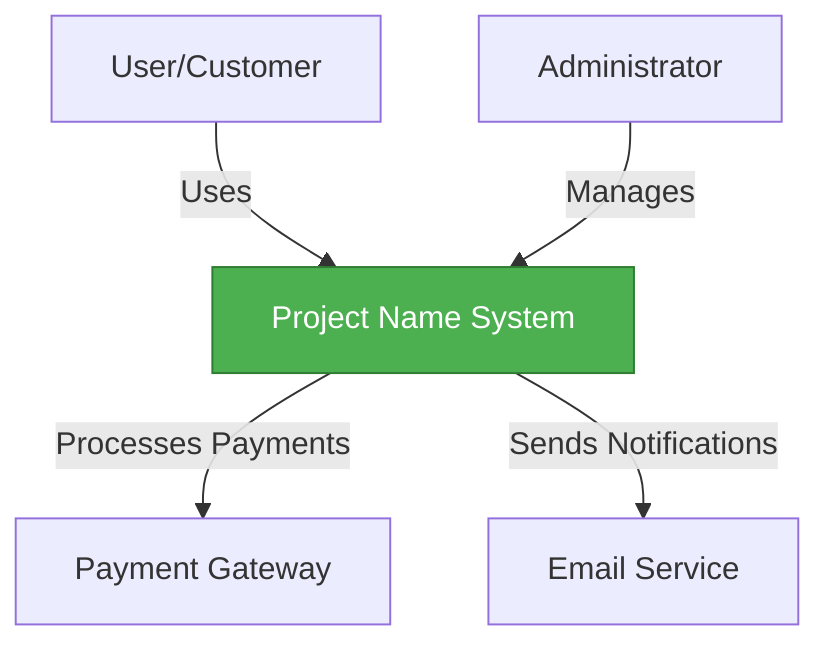

### Container Diagram

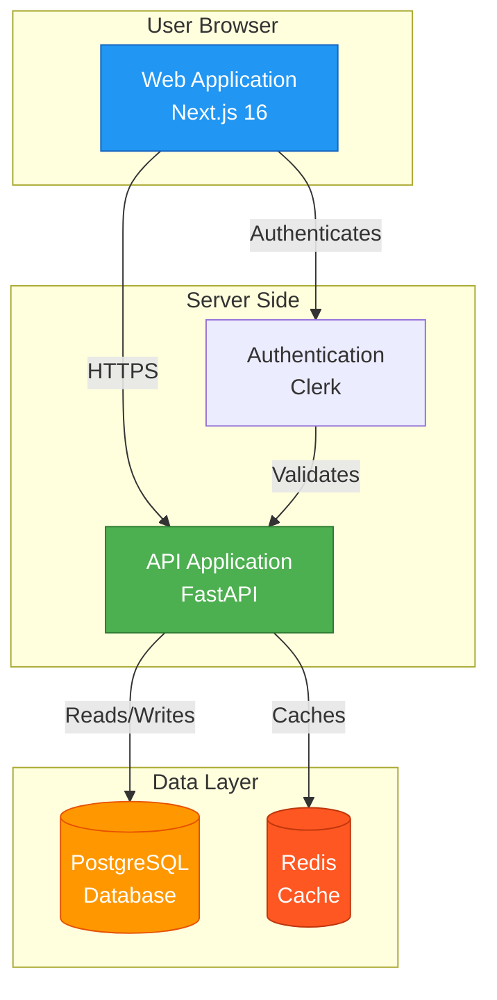

### Component Diagram

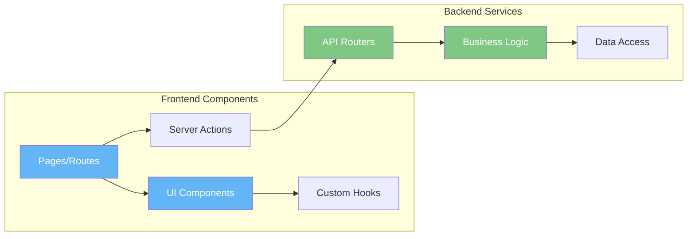

### Sequence Diagram (Authentication Flow)

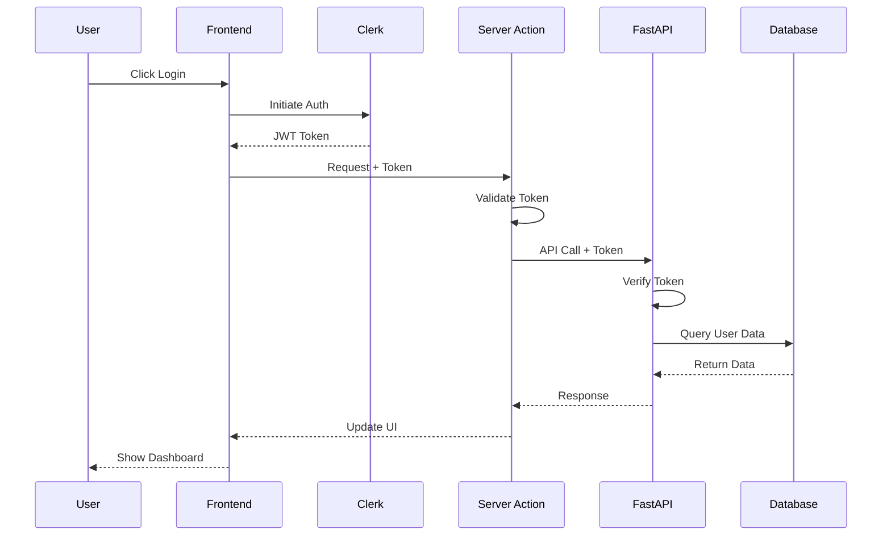

### Entity Relationship Diagram

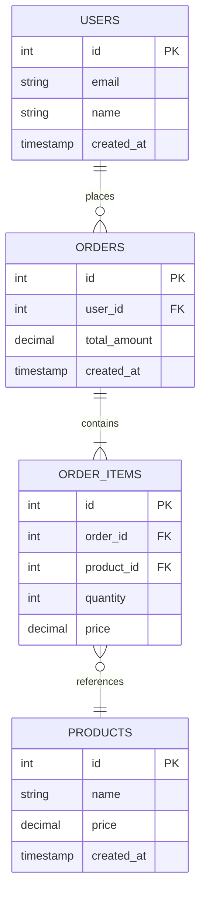

## Diagram Best Practices

### Layout
- ✅ Keep diagrams focused (one concept per diagram)
- ✅ Use consistent colors for component types
- ✅ Include legends for color coding
- ✅ Left-to-right or top-to-bottom flow
- ❌ Don't overcrowd diagrams with too many components

### Naming
- ✅ Use clear, descriptive labels
- ✅ Include technology names in component labels
- ✅ Show key relationships explicitly
- ❌ Don't use abbreviations without explanation

### Color Scheme (Recommended)

| Component Type | Color | Example |
|---------------|-------|---------|
| Frontend | Blue (#2196F3) | Next.js, React components |
| Backend | Green (#4CAF50) | FastAPI, services |
| Database | Orange (#FF9800) | PostgreSQL, Redis |
| External | Purple (#9C27B0) | Third-party APIs |
| Security | Red (#F44336) | Auth services |

## Linking to Standards Repository

Every project architecture document should link back to the standards repository for generic patterns:

### Example Links in Documents

```markdown
## Technology Stack

This project follows the [Frontend Tech Stack Standards](https://github.com/your-org/standards/blob/main/frontend/tech-stack.md) with the following project-specific configurations:

- **Framework**: Next.js 16.0.0
- **React**: 19.0.0
- **TypeScript**: 5.3.3

For general TypeScript conventions, see [TypeScript Standards](https://github.com/your-org/standards/blob/main/frontend/typescript.md).

### Project-Specific Decisions

- Using App Router exclusively (no Pages Router)
- All data fetching through server actions
- Centralized error handling in `lib/errors/`
```

### References Document Template

Create `references/standards-mapping.md`:

```markdown
# Standards Mapping

This document maps our project architecture to the organization's standards repository.

## Frontend Standards

| Our Implementation | Standards Reference |
|-------------------|---------------------|
| `src/app/` | [Frontend Structure](https://github.com/your-org/standards/blob/main/frontend/README.md) |
| `src/app/actions/` | [Server Actions](https://github.com/your-org/standards/blob/main/frontend/server-actions.md) |
| `src/components/` | [Component Standards](https://github.com/your-org/standards/blob/main/frontend/typescript.md#components) |

## Backend Standards

| Our Implementation | Standards Reference |
|-------------------|---------------------|
| `app/api/routers/` | [API Design](https://github.com/your-org/standards/blob/main/backend/tech-stack.md) |
| `app/models/` | [Database Models](https://github.com/your-org/standards/blob/main/database/naming-conventions.md) |

## Architecture Patterns

| Pattern | Standards Reference |
|---------|---------------------|
| Data Flow | [Data Flow Patterns](https://github.com/your-org/standards/blob/main/architecture/data-flow.md) |
| Authentication | [Auth Architecture](https://github.com/your-org/standards/blob/main/architecture/README.md#authentication-flow) |
| Error Handling | [Error Handling](https://github.com/your-org/standards/blob/main/architecture/error-handling.md) |
```

## Review and Maintenance

### Regular Reviews

Architecture documentation should be reviewed:

| Event | Review Required | Version Update |
|-------|----------------|----------------|
| Sprint Planning | Check for planned changes | N/A |
| Major Feature Release | Update affected sections | MINOR or MAJOR |
| Technology Upgrade | Update tech stack docs | MINOR |
| Security Incident | Review security architecture | PATCH or MINOR |
| Quarterly Review | Verify accuracy | PATCH if needed |
| Production Issues | Update relevant sections | PATCH |

### Review Checklist

- [ ] System diagrams reflect current architecture
- [ ] Technology stack versions are current
- [ ] All endpoints documented
- [ ] Database schema matches production
- [ ] Security measures documented
- [ ] Performance optimizations captured
- [ ] Third-party services listed
- [ ] Deployment process documented
- [ ] Links to standards repository valid
- [ ] CHANGELOG.md updated

## Best Practices

### ✅ DO

- **Start Early**: Begin documentation before coding starts
- **Keep Updated**: Update architecture docs with code changes
- **Be Specific**: Include versions, configurations, and rationale
- **Link Standards**: Reference generic standards, document specifics
- **Use Diagrams**: Visual representations for complex concepts
- **Version Control**: Track all changes in git
- **Review Regularly**: Schedule quarterly architecture reviews
- **Document Decisions**: Explain why, not just what

### ❌ DON'T

- **Don't Copy Standards**: Link to standards, document differences
- **Don't Let It Stale**: Update with major changes immediately
- **Don't Over-Abstract**: Be specific to your project
- **Don't Skimp on Diagrams**: They're worth the effort
- **Don't Forget Security**: Security architecture is critical
- **Don't Ignore Performance**: Document performance strategies
- **Don't Work in Isolation**: Collaborate with team on architecture
- **Don't Skip Version Updates**: Maintain proper semantic versioning

## Getting Started Checklist

When starting a new project architecture repository:

- [ ] Create repository with naming convention: `[project-name]-architecture`
- [ ] Copy template structure from standards repository
- [ ] Customize root README.md with project information
- [ ] Document technology stack decisions in `technology-stack/`
- [ ] Create system context diagram
- [ ] Create container diagram
- [ ] Create component diagrams for major components
- [ ] Document database schema with ER diagram
- [ ] Document all API endpoints
- [ ] Document authentication and authorization
- [ ] Document security architecture
- [ ] Document performance strategy
- [ ] Create references/standards-mapping.md
- [ ] Set initial version to 1.0.0
- [ ] Create initial CHANGELOG.md entry
- [ ] Tag repository: `git tag -a v1.0.0 -m "Initial architecture"`
- [ ] Share with team for review

## Related Standards

- [Documentation Standard](./documentation-standard.md) - Generic documentation guidelines
- [Specification Standard](./specification-standard.md) - Feature and API specification guidelines
- [New Project Setup Guide](../guides/new-project-setup.md) - Step-by-step project setup
- [CLAUDE.md](../CLAUDE.md) - Workflow guidance and navigation
- [Architecture Patterns](../architecture/README.md) - System architecture patterns
- [Frontend Standards](../frontend/README.md) - Frontend implementation standards
- [Backend Standards](../backend/README.md) - Backend implementation standards
- [Database Standards](../database/README.md) - Database design standards
- [Development Workflow](../devops/development-workflow.md) - Development process

## Template Locations

### Project Documentation Templates (Primary)

Templates for creating project documentation folders:

```
standards/templates/project-docs/
├── README.md                    # Template overview
├── project-readme.md            # Project hub README
├── claude-instructions.md       # CLAUDE.md template
├── task-tracker.md              # Sprint task tracking
├── implementation-plan.md       # Phased implementation
└── development-workflow.md      # Project-specific workflow
```

### Architecture Repository Templates (Legacy)

For projects requiring a separate architecture repository:

```
standards/templates/architecture-repository/
├── blank-template/              # Ready to fill in
└── example-project/             # Fully documented example
```

---

*Part of the Standards Documentation Repository*
*Version 2.0.0 - Updated for multi-repository pattern*

---

<!-- Source: standards/documentation/business-requirements-standard.md (v1.0.1) -->

# Business Requirements Document (BRD) Standard

**Version**: 1.0.0
**Last Updated**: 2025-12-30
**Status**: Active
**Category**: Meta-Documentation

## Purpose

This standard defines how to create Business Requirements Documents (BRDs) that capture the business context, objectives, and requirements before technical design begins. BRDs ensure alignment between business stakeholders and technical teams, establishing the "what" and "why" before specifications define the "how."

## Scope

- **Applies to**: New features, product initiatives, significant enhancements, system redesigns
- **Not covered**: Bug fixes, minor enhancements, purely technical changes (use specifications directly)
- **Workflow Position**: **BRD** → Architecture → Specifications → Implementation → QA

## Relationship to Other Documentation

```
┌─────────────────────────────────────────────────────────────┐
│   Business Requirements Document (BRD)        ← THIS DOC     │
│   - Business context, problem statement                      │
│   - Business objectives & success metrics                    │
│   - Stakeholder alignment                                    │
│   - High-level requirements (BR-XXX)                         │
└─────────────────────────────────────────────────────────────┘
                         │
                         │ Informs
                         ▼
┌─────────────────────────────────────────────────────────────┐
│   Product Requirements Document (PRD)                        │
│   - User personas & target audience                          │
│   - User stories & use cases                                 │
│   - Feature definitions (FEAT-XXX)                           │
│   - Traces back to BR-XXX                                    │
└─────────────────────────────────────────────────────────────┘
                         │
                         │ Informs
                         ▼
┌─────────────────────────────────────────────────────────────┐
│   Architecture Documentation                                 │
│   - System design decisions                                  │
│   - Technical approach                                       │
└─────────────────────────────────────────────────────────────┘
                         │
                         │ Guides
                         ▼
┌─────────────────────────────────────────────────────────────┐
│   Specifications (SPEC-XXX)                                  │
│   - Technical requirements (FR-XXX)                          │
│   - API contracts, data models                               │
│   - Traces back to FEAT-XXX and BR-XXX                       │
└─────────────────────────────────────────────────────────────┘
                         │
                         │ Guides
                         ▼
┌─────────────────────────────────────────────────────────────┐
│   Implementation                                             │
│   - Code references spec IDs                                 │
│   - Tests verify acceptance criteria                         │
│   - QA validates business requirements met                   │
└─────────────────────────────────────────────────────────────┘
```

## Relationship to Product Requirements Document (PRD)

When a BRD defines business requirements, a Product Requirements Document (PRD) may follow to translate those into product features:

### When PRD Follows BRD

| BRD Defines | PRD Translates To |
|-------------|-------------------|
| Business objective (BR-001) | Product features (FEAT-XXX) |
| Success metrics (KPIs) | Product success metrics |
| Target market | User personas |
| Business requirements | User stories and use cases |

### Traceability Chain

```
BRD (BR-XXX) → PRD (FEAT-XXX, US-XXX) → Spec (FR-XXX) → Tests (IT-XXX)
```

### When to Create PRD After BRD

**Create PRD when**:
- BRD defines business requirements that need product translation
- User personas and user stories are needed
- Multiple product features emerge from business requirements
- UX/design work is required before technical specification

**Skip PRD when**:
- BRD requirements map directly to technical specifications
- No user-facing product changes
- Business process change without product features

See [Product Requirements Standard](./product-requirements-standard.md) for full PRD guidance.

## Complete Development Workflow

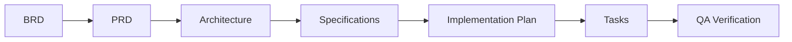

| Stage | Document | Purpose | Owner |
|-------|----------|---------|-------|
| 0. Business Requirements | `BRD-XXX-name.md` | Define business WHAT and WHY | Business Owner |
| 0.5 Product Requirements | `PRD-XXX-name.md` | Define product WHAT for users | Product Owner |
| 1. Architecture | `architecture/*.md` | Define system design | Tech Lead |
| 2. Specifications | `SPEC-XXX-name.md` | Define HOW technically | Engineering |
| 3. Implementation Plan | `implementation-plan.md` | Define phases & milestones | Engineering |
| 4. Tasks | `task-tracker.md` | Track individual work items | Team |
| 5. QA Verification | Test results & sign-off | Verify requirements met | QA |

## When to Create a BRD

### Create a BRD When

```
New Initiative?
├── Is business context unclear or undefined?
│   └── Yes → Create BRD
├── Are there multiple stakeholders with different priorities?
│   └── Yes → Create BRD
├── Are success metrics needed to measure impact?
│   └── Yes → Create BRD
├── Is this a significant investment (>2 weeks effort)?
│   └── Yes → Create BRD
├── Does this affect business processes or workflows?
│   └── Yes → Create BRD
└── Is cross-team alignment required?
    └── Yes → Create BRD
```

### Skip BRD When

- Bug fixes with clear reproduction steps
- Purely technical improvements (refactoring, performance)
- Small enhancements with obvious requirements
- Features already defined in approved product roadmap documents

### Decision Tree

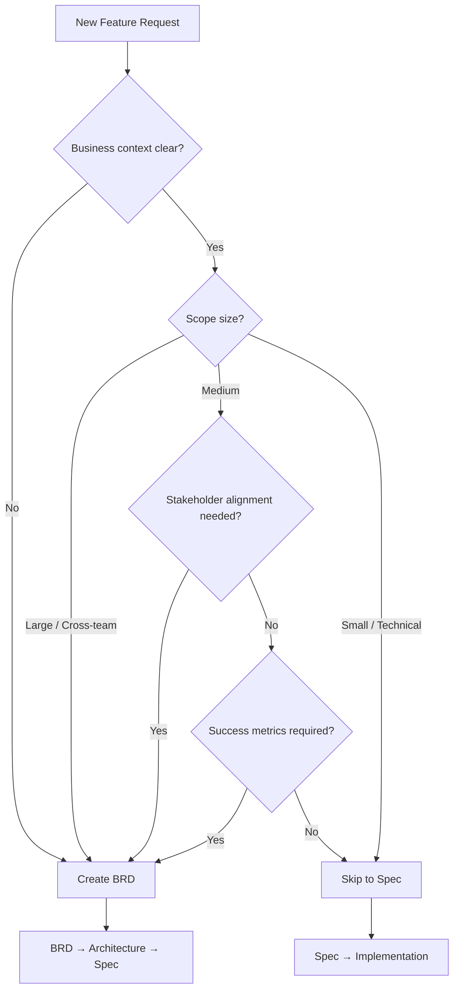

## BRD Tiers

Choose the appropriate tier based on initiative complexity and business impact:

| Tier | Name | When to Use | Effort |
|------|------|-------------|--------|
| **1** | Full | Major product initiatives, strategic projects, cross-team initiatives | 4-8 hours |
| **2** | Standard | Significant features, moderate business impact, defined stakeholders | 2-4 hours |
| **3** | Lightweight | Smaller features with clear business value, single team scope | 1-2 hours |

### Required Sections by Tier

| Section | Tier 1 | Tier 2 | Tier 3 |
|---------|--------|--------|--------|
| Executive Summary | Required | Required | Required |
| Business Context | Required | Required | Brief |
| Problem Statement | Required | Required | Required |
| Business Objectives | Required | Required | Required |
| Success Metrics (KPIs) | Required | Required | Key metrics only |
| Stakeholders | Required | Required | Key roles only |
| Scope (In/Out) | Required | Required | Required |
| Business Requirements | Required | Required | Required |
| Assumptions | Required | Required | Optional |
| Constraints | Required | Required | Optional |
| Dependencies | Required | Required | If applicable |
| Risks | Required | Required | Key risks only |
| Timeline | Required | Required | Target only |
| Approval Sign-off | Required | Required | Required |

## BRD ID Convention

```
BRD-[NUMBER]
```

**Numbering**: Sequential, padded to 3 digits.

**Examples**:
- `BRD-001` - Customer Onboarding Redesign
- `BRD-012` - Multi-Currency Support
- `BRD-023` - Partner Portal Integration

**File Naming**:
```
BRD-[NUMBER]-[kebab-case-name].md
```

Examples:
- `BRD-001-customer-onboarding-redesign.md`
- `BRD-012-multi-currency-support.md`
- `BRD-023-partner-portal-integration.md`

## Core Sections

### 1. Header & Metadata

Every BRD must start with:

```markdown
# [Initiative Name]

**BRD ID**: BRD-[NUMBER]
**Version**: 1.0.0
**Created**: YYYY-MM-DD
**Last Updated**: YYYY-MM-DD
**Status**: Draft | Review | Approved | Superseded
**Tier**: Full | Standard | Lightweight
**Author**: [Name]
**Business Owner**: [Name]
**Reviewers**: [Names]

## Related Documentation
- **Product Roadmap**: [Link]
- **Architecture Doc**: [Link when available]
- **Specifications**: [Links when created]
```

### 2. Executive Summary

Provide a concise overview for executives and stakeholders:

```markdown
## Executive Summary

[1-2 paragraph summary covering:]
- What is being proposed
- Why it matters to the business
- Expected outcomes
- High-level timeline
```

### 3. Business Context

Establish the business backdrop:

```markdown
## Business Context

### Current State
[Describe how things work today, including pain points]

### Market/Competitive Context
[Relevant market conditions, competitive pressures]

### Strategic Alignment
[How this initiative aligns with company strategy/OKRs]
```

### 4. Problem Statement

Clearly articulate the problem:

```markdown
## Problem Statement

### Problem
[2-3 sentences describing the problem from the business/user perspective]

### Impact
- [Business impact 1 - quantified if possible]
- [Business impact 2]
- [Customer impact]

### Root Cause
[If known, what's causing this problem]
```

### 5. Business Objectives

Define clear, measurable objectives:

```markdown
## Business Objectives

### Primary Objectives
1. [Objective 1 - SMART format]
2. [Objective 2]

### Secondary Objectives
1. [Nice-to-have objective 1]

### Non-Objectives
- [Explicitly out of scope item 1]
- [Explicitly out of scope item 2]
```

### 6. Success Metrics (KPIs)

Define how success will be measured:

```markdown
## Success Metrics

| Metric | Current | Target | Timeline | Measurement Method |
|--------|---------|--------|----------|-------------------|
| [Metric name] | [Baseline] | [Target] | [By when] | [How measured] |
| [Metric name] | [Baseline] | [Target] | [By when] | [How measured] |

### Leading Indicators
- [Metric that predicts success]

### Lagging Indicators
- [Metric that confirms success after the fact]
```

### 7. Stakeholders

Identify all stakeholders:

```markdown
## Stakeholders

| Role | Name | Responsibility | Decision Rights |
|------|------|----------------|-----------------|
| Business Owner | [Name] | Overall accountability | Final approval |
| Product Manager | [Name] | Requirements definition | Requirement changes |
| Tech Lead | [Name] | Technical feasibility | Technical decisions |
| QA Lead | [Name] | Quality assurance | Test sign-off |
| [User Role] | [Representative] | User perspective | None (advisory) |
```

### 8. Scope

Define clear boundaries:

```markdown
## Scope

### In Scope
- [Feature/capability 1]
- [Feature/capability 2]
- [User segment covered]

### Out of Scope
- [Explicitly excluded item 1]
- [Explicitly excluded item 2]
- [Deferred to future phase]

### Future Considerations
- [Item for future phases]
```

### 9. Business Requirements

Number and prioritize business requirements:

```markdown
## Business Requirements

### Requirement Categories

#### Customer Experience
| ID | Requirement | Priority | Rationale |
|----|-------------|----------|-----------|
| BR-001 | [Requirement description] | Must Have | [Business justification] |
| BR-002 | [Requirement description] | Should Have | [Business justification] |

#### Business Operations
| ID | Requirement | Priority | Rationale |
|----|-------------|----------|-----------|
| BR-003 | [Requirement description] | Must Have | [Business justification] |

#### Compliance/Regulatory
| ID | Requirement | Priority | Rationale |
|----|-------------|----------|-----------|
| BR-004 | [Requirement description] | Must Have | [Legal/compliance reason] |
```

**Priority Levels (MoSCoW)**:
- **Must Have**: Critical for business value, non-negotiable
- **Should Have**: Important for full business value, can defer if needed
- **Could Have**: Enhances business value, low priority
- **Won't Have**: Explicitly excluded from this initiative

### 10. Constraints & Assumptions

Document constraints and assumptions:

```markdown
## Constraints & Assumptions

### Constraints
| Constraint | Impact | Mitigation |
|------------|--------|------------|
| Budget limited to $X | Scope limitations | Phased approach |
| Must launch by Q2 | Reduced scope | Prioritize must-haves |
| Legacy system compatibility | Technical complexity | Integration layer |

### Assumptions
| Assumption | If False | Validation |
|------------|----------|------------|
| Users prefer X over Y | Rework needed | User research |
| Third-party API available | Delay or workaround | Vendor confirmation |
```

### 11. Dependencies

Identify dependencies:

```markdown
## Dependencies

### Internal Dependencies
| Dependency | Team | Status | Impact if Delayed |
|------------|------|--------|-------------------|
| [Dependency] | [Team] | [Status] | [Impact] |

### External Dependencies
| Dependency | Vendor/Partner | Status | Contingency |
|------------|----------------|--------|-------------|
| [Dependency] | [Vendor] | [Status] | [Backup plan] |
```

### 12. Risks

Identify and assess risks:

```markdown
## Risks

| Risk | Probability | Impact | Mitigation | Owner |
|------|-------------|--------|------------|-------|
| [Risk description] | High/Med/Low | High/Med/Low | [Mitigation strategy] | [Name] |
| User adoption low | Medium | High | Early beta testing | PM |
| Integration delays | Low | High | Parallel workstreams | Tech Lead |
```

### 13. Timeline & Priority

Define high-level timeline:

```markdown
## Timeline & Priority

### Priority Ranking
**Business Priority**: P1 (Critical) | P2 (High) | P3 (Medium) | P4 (Low)

### Key Milestones
| Milestone | Target Date | Dependencies |
|-----------|-------------|--------------|
| BRD Approved | YYYY-MM-DD | Stakeholder review |
| Architecture Complete | YYYY-MM-DD | BRD approval |
| Specifications Complete | YYYY-MM-DD | Architecture |
| Development Complete | YYYY-MM-DD | Specifications |
| QA Complete | YYYY-MM-DD | Development |
| Launch | YYYY-MM-DD | QA sign-off |

### Phases (if applicable)
| Stage | Scope | Target Date |
|-------|-------|-------------|
| Stage 1 (MVP) | BR-001, BR-002 | Q1 2025 |
| Stage 2 | BR-003, BR-004 | Q2 2025 |
```

### 14. Approval

Document stakeholder approval:

```markdown
## Approval

| Role | Name | Date | Status | Signature |
|------|------|------|--------|-----------|
| Business Owner | | | Pending | |
| Product Manager | | | Pending | |
| Tech Lead | | | Pending | |
| QA Lead | | | Pending | |

### Approval Criteria
- [ ] All sections completed
- [ ] Success metrics are measurable
- [ ] Scope is clearly defined
- [ ] Budget approved (if applicable)
- [ ] Timeline is feasible
```

### 15. Revision History

Track changes:

```markdown
## Revision History

| Version | Date | Author | Changes |
|---------|------|--------|---------|
| 1.0.0 | YYYY-MM-DD | [Name] | Initial BRD |
| 1.1.0 | YYYY-MM-DD | [Name] | Updated scope based on feedback |
```

## Traceability

### BRD to Specifications

Business requirements should trace to specifications:

```
BRD Requirements (BR-XXX)
    │
    ├── BR-001: Customer can upload profile photos
    │   └── SPEC-FEAT-003: Photo Upload Feature
    │       ├── FR-001: Support JPG, PNG, WebP formats
    │       ├── FR-002: Max file size 5MB
    │       └── FR-003: Auto-resize to standard dimensions
    │
    └── BR-002: Customer photos display across platform
        └── SPEC-FEAT-004: Photo Display Integration
            ├── FR-001: Display in profile header
            └── FR-002: Display in comments
```

### Traceability Matrix

Maintain in each spec that references a BRD:

```markdown
## Traceability to Business Requirements

| Business Requirement | Spec Requirement | Test Case | Status |
|---------------------|------------------|-----------|--------|
| BR-001 | FR-001, FR-002, FR-003 | IT-001, IT-002 | Pending |
| BR-002 | FR-001, FR-002 | IT-003 | Pending |
```

## Status Lifecycle

```
Draft → Review → Approved → Superseded
          ↓
       Revision (back to Draft)
```

**Status Definitions**:
- **Draft**: Initial creation, incomplete
- **Review**: Ready for stakeholder review
- **Approved**: Signed off, ready for architecture/specification
- **Superseded**: Replaced by newer BRD or no longer applicable

## File Organization

### In Project Documentation Folder

```
repos/{project-name}/
├── README.md                           # Project hub
├── CLAUDE.md                           # AI guidance
├── task-tracker.md                     # Sprint tracking
├── implementation-plan.md              # Phased implementation
│
├── business-requirements/              # BRDs
│   ├── README.md                       # BRD index and status
│   ├── BRD-001-customer-onboarding.md
│   ├── BRD-002-payment-processing.md
│   └── BRD-003-analytics-dashboard.md
│
├── architecture/                       # Architecture docs
│   └── ...
│
└── specifications/                     # Technical specs
    └── ...
```

## Best Practices

### Do

- **Start with Problem**: Clearly articulate the problem before proposing solutions
- **Be Business-Focused**: Use business language, not technical jargon
- **Quantify Impact**: Include numbers wherever possible (revenue, users, time saved)
- **Define Success**: Establish measurable KPIs upfront
- **Engage Stakeholders**: Get input from all affected parties early
- **Prioritize Ruthlessly**: Use MoSCoW to distinguish must-haves from nice-to-haves
- **Document Assumptions**: Make assumptions explicit for later validation
- **Link to Strategy**: Show how the initiative supports broader business goals

### Don't

- **Don't Specify Solutions**: Focus on requirements, not implementation details
- **Don't Skip Stakeholders**: Incomplete stakeholder input leads to scope creep
- **Don't Ignore Risks**: Unacknowledged risks become surprises later
- **Don't Over-Document**: Match BRD detail to initiative size (use tiers)
- **Don't Forget Metrics**: No metrics = no way to measure success
- **Don't Delay Approval**: Unapproved BRDs shouldn't proceed to specs
- **Don't Mix Business/Technical**: Keep BRD focused on business needs

## Examples

### Good Example: Business Requirement

```markdown
#### BR-001: Customer Profile Personalization
**Priority**: Must Have

**Requirement**:
Customers must be able to upload and display a profile photo to personalize their account.

**Business Rationale**:
User research shows 73% of customers prefer platforms where they can personalize their profile.
Competitor analysis indicates this is a table-stakes feature. Expected to improve
customer satisfaction scores by 15%.

**Acceptance Criteria**:
- Customer can upload a photo from their device
- Photo displays in all areas where customer identity is shown
- Customer can update or remove photo at any time
```

### Bad Example: Business Requirement

```markdown
#### BR-001: Photo Upload
**Priority**: High

**Requirement**:
Add photo upload feature.

**Rationale**:
Users want it.
```

**Why it's bad**:
- Vague requirement with no business context
- No quantified rationale
- Priority not using standard levels
- No acceptance criteria
- No traceability to business value

### Good Example: Success Metrics

```markdown
## Success Metrics

| Metric | Current | Target | Timeline | Measurement |
|--------|---------|--------|----------|-------------|
| Profile completion rate | 42% | 65% | 3 months post-launch | Analytics dashboard |
| Customer satisfaction (CSAT) | 3.8/5 | 4.2/5 | 6 months post-launch | Quarterly survey |
| User engagement (DAU/MAU) | 0.23 | 0.30 | 3 months post-launch | Product analytics |
```

### Bad Example: Success Metrics

```markdown
## Success Metrics

- More users
- Better satisfaction
- Increased engagement
```

**Why it's bad**:
- No baseline measurements
- No specific targets
- No timeline
- No measurement method
- Not actionable

## Checklist

Before marking a BRD as "Review":

- [ ] BRD ID assigned following convention
- [ ] All required sections for tier are complete
- [ ] Executive summary is clear and concise
- [ ] Problem statement is specific and quantified
- [ ] Business objectives are SMART (Specific, Measurable, Achievable, Relevant, Time-bound)
- [ ] Success metrics have baselines and targets
- [ ] All stakeholders identified with clear roles
- [ ] Scope clearly defines in/out boundaries
- [ ] Business requirements numbered (BR-XXX)
- [ ] Requirements prioritized using MoSCoW
- [ ] Assumptions and constraints documented
- [ ] Key risks identified with mitigations
- [ ] Timeline includes major milestones
- [ ] Related documentation linked
- [ ] Version set to 1.0.0 (or incremented)

## Related Standards

- [Product Requirements Standard](./product-requirements-standard.md) - PRD standard (follows BRD)
- [Documentation Standard](./documentation-standard.md) - General documentation guidelines
- [Specification Standard](./specification-standard.md) - Technical specifications (BRD feeds into this)
- [Architecture Definition Standard](./architecture-definition.md) - Project architecture documentation
- [Discovery Standard](./discovery-standard.md) - Stakeholder interview phase (may precede BRD)

## References

- [IEEE 830-1998](https://standards.ieee.org/standard/830-1998.html) - Software Requirements Specification
- [IIBA BABOK Guide](https://www.iiba.org/babok-guide/) - Business Analysis Body of Knowledge
- [MoSCoW Prioritization](https://www.productplan.com/glossary/moscow-prioritization/)
- [SMART Goals](https://www.mindtools.com/pages/article/smart-goals.htm)

## Revision History

| Version | Date | Author | Changes |
|---------|------|--------|---------|
| 1.0.0 | 2025-12-30 | Standards Team | Initial BRD standard |

---

<!-- Source: standards/documentation/discovery-standard.md (v1.0.0) -->

# Discovery Standard

**Version**: 1.0.0
**Last Updated**: 2026-01-03
**Status**: Active
**Owner**: Product/Engineering Lead
**Dependencies**: None (this is the first phase)

---

## Purpose

This standard defines the Discovery phase (Phase -0.5) of the documentation workflow. Discovery is the foundational phase where stakeholder interviews, user research, and problem validation occur before formal documentation begins.

Discovery ensures that subsequent documents (BRD, PRD, Specifications) are grounded in validated understanding rather than assumptions.

---

## When Discovery is Required

### Required

- New product or major initiative
- Unclear or undefined business context
- Multiple stakeholders with potentially conflicting priorities
- New market entry or significant pivot
- Projects with >2 weeks estimated effort
- Cross-functional initiatives

### Optional (Lightweight)

- Medium features with clear context
- Enhancements to existing products where user needs are understood
- Technical improvements with known stakeholder requirements

### Skip

- Bug fixes
- Technical refactoring with no user-facing changes
- Small enhancements where requirements are explicit
- Emergency fixes

---

## Discovery Activities

### 1. Stakeholder Interviews

**Purpose**: Gather firsthand perspectives from people affected by or invested in the project.

**Participants**:
- Business sponsors
- End users (internal or external)
- Subject matter experts
- Technical leads
- Support/operations teams

**Key Questions**:
- What problem are we trying to solve?
- Who experiences this problem?
- What does success look like?
- What constraints exist (budget, timeline, technology)?
- What has been tried before?
- What are the risks of not solving this?

### 2. Current State Analysis

**Purpose**: Document how things work today before proposing changes.

**Activities**:
- Map existing workflows
- Identify pain points and bottlenecks
- Document workarounds currently in use
- Measure current performance (if applicable)
- Review existing documentation and systems

### 3. Problem Validation

**Purpose**: Confirm the problem is real, significant, and worth solving.

**Validation Methods**:
- Multiple stakeholders confirm the problem exists
- Quantify impact (time lost, revenue impact, user frustration)
- Prioritize against other known problems
- Confirm timing is appropriate

### 4. Competitive/Market Analysis (If Applicable)

**Purpose**: Understand how others solve similar problems.

**Activities**:
- Review competitor solutions
- Identify industry best practices
- Assess buy vs. build options
- Document differentiation requirements

### 5. Constraint Identification

**Purpose**: Surface limitations early before planning begins.

**Constraint Types**:
- **Technical**: Platform limitations, integration requirements, legacy systems
- **Regulatory**: Compliance requirements (GDPR, HIPAA, SOC 2)
- **Resource**: Budget, team capacity, timeline
- **Organizational**: Approval processes, dependencies on other teams
- **Security**: Data sensitivity, authentication requirements

---

## Discovery Deliverables

A completed Discovery phase produces a **Discovery Document** with:

| Section | Content |
|---------|---------|
| **Problem Statement** | Validated description of the problem being solved |
| **Stakeholder Summary** | Who was interviewed, key findings from each |
| **Current State** | How things work today, pain points, workarounds |
| **Pain Points** | Prioritized list of issues to address |
| **Opportunities** | Potential improvements beyond minimum scope |
| **Constraints** | Technical, regulatory, resource, organizational limits |
| **Assumptions** | What we believe to be true but haven't validated |
| **Open Questions** | Items requiring further investigation |
| **Glossary** | Domain-specific terms and definitions |
| **Recommendation** | Next stage recommendation (BRD, PRD, or Spec) |

---

## Discovery Document Naming

```
DISC-[NNN]-[kebab-case-title].md

Examples:
DISC-001-customer-onboarding-flow.md
DISC-002-payment-processing-modernization.md
DISC-003-mobile-app-performance.md
```

---

## Definition of Ready (DoR)

Before Discovery can begin:
- [ ] Project or initiative has been proposed
- [ ] Sponsor or requester is identified
- [ ] Access to stakeholders is confirmed
- [ ] Time allocated for interviews (minimum 2-3 sessions)

---

## Definition of Done (DoD)

Discovery is complete when:
- [ ] At least 3 stakeholders interviewed (or appropriate number for scope)
- [ ] Problem statement validated by multiple sources
- [ ] Current state documented
- [ ] Constraints identified and documented
- [ ] Pain points prioritized
- [ ] Discovery document reviewed with sponsor
- [ ] Next stage recommendation made (BRD, PRD, or Specification)

---

## Workflow Integration

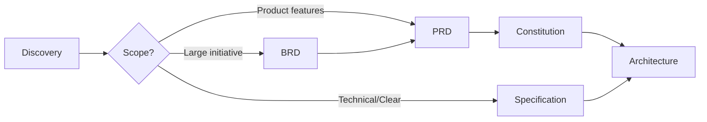

### Decision Guidance

| Discovery Finding | Next Phase |
|-------------------|------------|
| Business context unclear, multiple stakeholders, ROI needed | BRD |
| Business context clear, user-facing features, UX required | PRD |
| Technical changes, clear requirements, no user personas | Specification |

---

## Interview Best Practices

### Preparation
- Review any existing documentation beforehand
- Prepare open-ended questions (avoid yes/no)
- Allocate 30-60 minutes per session
- Inform participants of purpose in advance

### During Interview
- Listen more than talk (80/20 rule)
- Ask follow-up questions ("Tell me more about...")
- Take notes on specific examples and quotes
- Ask about edge cases and exceptions
- Identify other people to talk to

### After Interview
- Summarize key findings within 24 hours
- Identify patterns across interviews
- Note contradictions or conflicting perspectives
- Update Discovery document

---

## Lightweight Discovery

For smaller initiatives where full Discovery is optional, conduct a **Lightweight Discovery**:

**Duration**: 1-2 hours total
**Activities**:
- Single stakeholder interview or async questionnaire
- Brief current state review
- Constraint checklist

**Output**: Abbreviated Discovery section in the Specification (not a separate document)

---

## Traceability

Discovery outputs feed into subsequent phases:

```
Discovery Outputs         → BRD/PRD/Spec Inputs
─────────────────────────────────────────────────
Problem Statement         → Problem Statement section
Pain Points              → Requirements (BR-XXX, US-XXX, FR-XXX)
Constraints              → Constraints section, Constitution
Assumptions              → Assumptions section
Glossary                 → Glossary, terminology consistency
Stakeholders             → RACI, approval sign-off
```

---

## Anti-Patterns

### Common Mistakes

| Anti-Pattern | Impact | Correct Approach |
|--------------|--------|------------------|
| Skipping Discovery for "obvious" projects | Unstated assumptions cause rework | At minimum, do Lightweight Discovery |
| Interviewing only sponsors | Missing user perspective | Include end users and operators |
| Documenting solutions during Discovery | Premature commitment | Focus on problem understanding first |
| One interview declares "done" | Single perspective bias | Minimum 3 stakeholders for validation |
| No documentation of findings | Knowledge loss, repeated questions | Document within 24 hours |

---

## Template Reference

Use the Discovery Template: [`templates/specifications/discovery-template.md`](../templates/specifications/discovery-template.md)

---

## Related Documents

- [Business Requirements Standard](./business-requirements-standard.md)
- [Product Requirements Standard](./product-requirements-standard.md)
- [Specification Standard](./specification-standard.md)
- [CLAUDE.md](../CLAUDE.md) - Documentation workflow
- [Architecture](../architecture/README.md) - System architecture patterns

---

*Part of the Standards Documentation Repository*

---

<!-- Source: standards/documentation/product-requirements-standard.md (v1.0.1) -->

# Product Requirements Document (PRD) Standard

**Version**: 1.0.0
**Last Updated**: 2026-01-03
**Status**: Active
**Category**: Meta-Documentation

## Purpose

This standard defines how to create Product Requirements Documents (PRDs) that capture the product vision, user personas, features, and user stories before technical specification begins. PRDs bridge the gap between Business Requirements Documents (BRD) and Technical Specifications, focusing on the "what" from a product perspective.

## Scope

- **Applies to**: Product features, user-facing functionality, product initiatives, major enhancements
- **Not covered**: Business strategy (use BRD), technical implementation details (use Specifications), bug fixes
- **Workflow Position**: BRD → **PRD** → Architecture → Specifications → Implementation → QA

## Relationship to Other Documentation

```
┌─────────────────────────────────────────────────────────────┐
│   Business Requirements Document (BRD)                       │
│   - Business context, problem statement                      │
│   - Business objectives & success metrics                    │
│   - Stakeholder alignment                                    │
│   - High-level requirements (BR-XXX)                         │
└─────────────────────────────────────────────────────────────┘
                         │
                         │ Informs
                         ▼
┌─────────────────────────────────────────────────────────────┐
│   Product Requirements Document (PRD)          ← THIS DOC    │
│   - User personas & target audience                          │
│   - User stories & use cases                                 │
│   - Feature definitions (FEAT-XXX)                           │
│   - Product success metrics                                  │
│   - Traces back to BR-XXX                                    │
└─────────────────────────────────────────────────────────────┘
                         │
                         │ Informs
                         ▼
┌─────────────────────────────────────────────────────────────┐
│   Architecture Documentation                                 │
│   - System design decisions                                  │
│   - Technical approach                                       │
└─────────────────────────────────────────────────────────────┘
                         │
                         │ Guides
                         ▼
┌─────────────────────────────────────────────────────────────┐
│   Specifications (SPEC-XXX)                                  │
│   - Technical requirements (FR-XXX)                          │
│   - API contracts, data models                               │
│   - Traces back to FEAT-XXX and BR-XXX                       │
└─────────────────────────────────────────────────────────────┘
                         │
                         │ Guides
                         ▼
┌─────────────────────────────────────────────────────────────┐
│   Implementation                                             │
│   - Code references spec IDs                                 │
│   - Tests verify acceptance criteria                         │
│   - QA validates requirements met                            │
└─────────────────────────────────────────────────────────────┘
```

## Complete Development Workflow


| Stage | Document | Purpose | Owner |
|-------|----------|---------|-------|
| 0. Business Requirements | `BRD-XXX-name.md` | Define business WHAT and WHY | Business Owner |
| **0.5 Product Requirements** | **`PRD-XXX-name.md`** | **Define product WHAT for users** | **Product Owner** |
| 1. Architecture | `architecture/*.md` | Define system design | Tech Lead |
| 2. Specifications | `SPEC-XXX-name.md` | Define HOW technically | Engineering |
| 3. Implementation Plan | `implementation-plan.md` | Define phases & milestones | Engineering |
| 4. Tasks | `task-tracker.md` | Track individual work items | Team |
| 5. QA Verification | Test results & sign-off | Verify requirements met | QA |

## When to Create a PRD

### Create a PRD When

```
New Feature/Initiative?
├── Is this a user-facing product feature?
│   └── Yes → Create PRD
├── Are there multiple user personas or use cases?
│   └── Yes → Create PRD
├── Is product definition needed before technical design?
│   └── Yes → Create PRD
├── Is this a significant feature (>1 week effort)?
│   └── Yes → Create PRD
├── Will this require UX/design work?
│   └── Yes → Create PRD
└── Are there feature trade-offs to document?
    └── Yes → Create PRD
```

### Skip PRD When

- Small enhancements with obvious requirements (go to Specification)
- Purely technical changes (refactoring, performance)
- Bug fixes with clear reproduction steps
- Features already fully defined in approved product roadmap
- Internal tools without user-facing components

### BRD vs PRD vs Specification Decision Tree

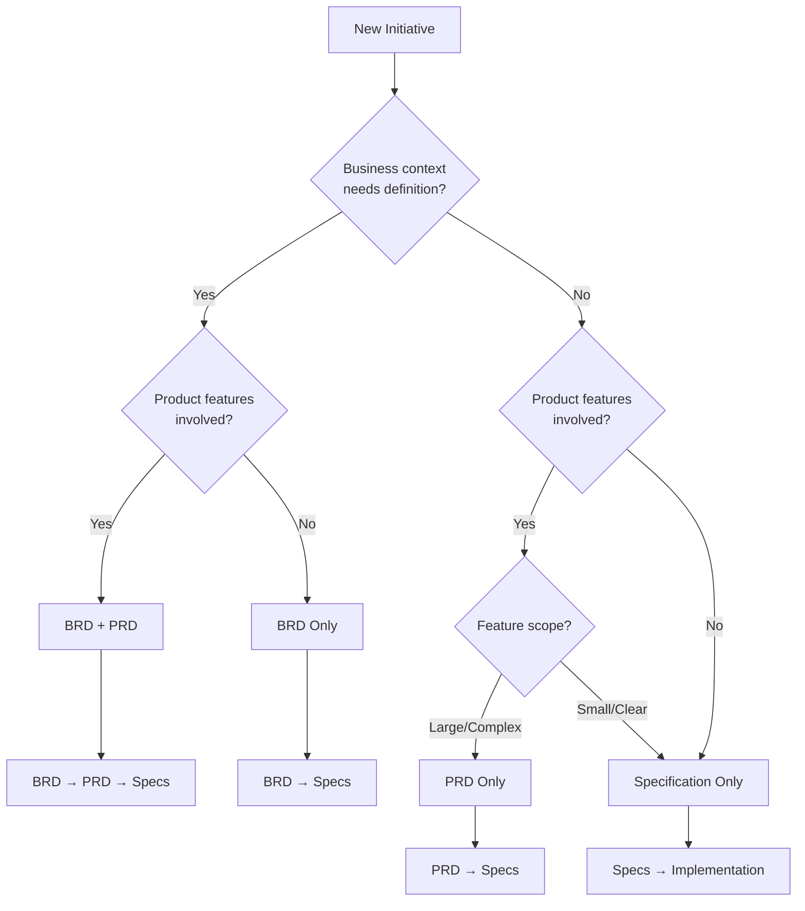

### Document Selection Matrix

| Scenario | BRD | PRD | Specs |
|----------|:---:|:---:|:-----:|
| New product line | Yes | Yes | Yes |
| Major feature (>2 weeks, multiple personas) | Maybe | Yes | Yes |
| Medium feature (clear business context) | No | Yes | Yes |
| Small feature (obvious requirements) | No | No | Yes |
| Business process change (no product UI) | Yes | No | Maybe |
| Technical refactoring | No | No | Yes |
| Bug fix | No | No | No |

## PRD Tiers

Choose the appropriate tier based on feature complexity and product impact:

| Tier | Name | When to Use | Effort |
|------|------|-------------|--------|
| **1** | Full | Major product features, new product areas, multiple personas | 6-12 hours |
| **2** | Standard | Significant features, moderate complexity, defined user base | 3-6 hours |
| **3** | Lightweight | Smaller features with clear product context, single persona | 1-3 hours |

### Required Sections by Tier

| Section | Tier 1 | Tier 2 | Tier 3 |
|---------|--------|--------|--------|
| Product Overview | Required | Required | Required |
| Target Users & Personas | Required (full) | Required (full) | Summary only |
| User Stories | Required | Required | Required |
| Use Cases | Required | Required | Key flows only |
| Feature Requirements | Required | Required | Required |
| Product Success Metrics | Required | Required | Key metrics only |
| UI/UX Requirements | Required | Simplified | Optional |
| Product Constraints | Required | Required | Required |
| Dependencies | Required | Required | Required |
| Product Roadmap | Required | Optional | Not required |
| Assumptions & Ambiguities | Required | Required | Simplified |
| Traceability | Required | Required | Required |
| Approval | Required | Required | Required |

## PRD ID Convention

```
PRD-[NUMBER]
```

**Numbering**: Sequential, padded to 3 digits.

**Examples**:
- `PRD-001` - Customer Dashboard Redesign
- `PRD-012` - Mobile App MVP
- `PRD-023` - Partner Portal Features

**File Naming**:
```
PRD-[NUMBER]-[kebab-case-name].md
```

Examples:
- `PRD-001-customer-dashboard-redesign.md`
- `PRD-012-mobile-app-mvp.md`
- `PRD-023-partner-portal-features.md`

## Core Sections

### 1. Header & Metadata

Every PRD must start with:

```markdown
# {Product/Feature Name}

**PRD ID**: PRD-{NUMBER}
**Version**: 1.0.0
**Created**: YYYY-MM-DD
**Last Updated**: YYYY-MM-DD
**Status**: Draft | Review | Approved | Superseded
**Tier**: Full | Standard | Lightweight
**Author**: {Name}
**Product Owner**: {Name}
**Reviewers**: {Names}

## Related Documentation
- **BRD Reference**: BRD-XXX (if applicable)
- **Architecture Doc**: {Link when available}
- **Specifications**: {Links when created}
```

### 2. Product Overview

Establish the product vision:

```markdown
## Product Overview

### Product Vision
{One paragraph describing what this product/feature will become and the value it provides to users}

### Product Goals
1. {Product goal 1 - measurable and user-focused}
2. {Product goal 2}

### Product Positioning
{How this product fits in the market/ecosystem, competitive differentiation}

### Non-Goals (Product Scope)
- {What this product explicitly will NOT do}
- {Features explicitly excluded}
```

### 3. Target Users & Personas

Define who will use the product:

```markdown
## Target Users & Personas

### Primary Persona: {Persona Name}

**Demographics**:
- Role: {Job title/role}
- Technical Level: {Novice/Intermediate/Expert}
- Usage Frequency: {Daily/Weekly/Monthly}

**Goals**:
- {What they want to achieve}
- {Key outcome they seek}

**Pain Points**:
- {Current frustration 1}
- {Current frustration 2}

**Key Behaviors**:
- {How they typically work}
- {Tools they currently use}

### Secondary Persona: {Persona Name}
{Same structure as primary}

### Excluded Users
- {User types NOT targeted by this product}
```

### 4. User Stories

Define user stories with acceptance criteria:

```markdown
## User Stories

### Epic: {Epic Name}

#### US-001: {Story Title}

**As a** {persona name}
**I want** {capability/action}
**So that** {benefit/value}

**Acceptance Criteria**:
```gherkin
Given {precondition}
When {action}
Then {expected result}
And {additional result}
```

**Priority**: Must Have | Should Have | Could Have | Won't Have
**Effort Estimate**: S | M | L | XL
**Feature Reference**: FEAT-XXX

#### US-002: {Story Title}
{Same structure}
```

**Priority Levels (MoSCoW)**:
- **Must Have**: Critical for product value, non-negotiable
- **Should Have**: Important for complete experience, can defer if needed
- **Could Have**: Enhances experience, low priority
- **Won't Have**: Explicitly excluded from this release

### 5. Use Cases

Detail interaction scenarios:

```markdown
## Use Cases

### UC-001: {Use Case Name}

**Actor**: {Primary persona}
**Preconditions**: {What must be true before}
**Trigger**: {What initiates this use case}

**Main Flow**:
1. {User action 1}
2. {System response 1}
3. {User action 2}
4. {System response 2}

**Alternative Flows**:
- 2a. If {condition}: {alternative step}
- 3a. If {error condition}: {error handling}

**Postconditions**: {What is true after completion}
**Error Conditions**: {What can go wrong}
**Feature Reference**: FEAT-XXX
```

### 6. Feature Requirements

Define features with priority:

```markdown
## Feature Requirements

### {Feature Category}

| Feature ID | Feature | Priority | User Stories | Description |
|------------|---------|----------|--------------|-------------|
| FEAT-001 | {Feature name} | Must Have | US-001, US-002 | {Brief description} |
| FEAT-002 | {Feature name} | Should Have | US-003 | {Brief description} |

### Feature Details

#### FEAT-001: {Feature Name}

**Priority**: Must Have
**Related User Stories**: US-001, US-002
**Business Requirement**: BR-001 (if BRD exists)

**Description**:
{Detailed feature description - what it does, not how it's built}

**Functional Behavior**:
- {Behavior 1}
- {Behavior 2}

**Constraints**:
- {Product-level limitation 1}
```

### 7. Product Success Metrics

Define product-level KPIs:

```markdown
## Product Success Metrics

### Product KPIs

| Metric | Baseline | Target | Timeline | Measurement |
|--------|----------|--------|----------|-------------|
| Feature adoption rate | N/A | 60% | 3 months | Analytics |
| Task completion rate | N/A | 85% | 3 months | Analytics |
| User satisfaction (NPS) | N/A | +40 | 6 months | Survey |

### Engagement Metrics

| Metric | Target | Measurement |
|--------|--------|-------------|
| Daily active users (DAU) | {target} | Analytics |
| Feature usage frequency | {target} | Analytics |
| Time to complete task | < {X} seconds | Analytics |

### Quality Metrics

| Metric | Target | Measurement |
|--------|--------|-------------|
| Error rate | < 1% | Monitoring |
| Support tickets | < {X}/month | Support system |
```

### 8. UI/UX Requirements

Define the user experience:

```markdown
## UI/UX Requirements

### Design Principles
- {Principle 1: e.g., "Minimal clicks to complete task"}
- {Principle 2: e.g., "Progressive disclosure"}

### Key Screens/Flows
1. {Screen/Flow 1}: {Brief description}
2. {Screen/Flow 2}: {Brief description}

### Wireframes
{Link to wireframes or embed simple ASCII diagrams}

### Interaction Patterns
- {Pattern 1}: {Description}
- {Pattern 2}: {Description}

### Accessibility Requirements
- WCAG 2.1 AA compliance
- {Specific accessibility requirement}
```

### 9. Product Constraints

Document product-level constraints:

```markdown
## Product Constraints

| Constraint | Impact | Rationale |
|------------|--------|-----------|
| {Constraint 1} | {Impact on product} | {Why this constraint exists} |
| {Constraint 2} | {Impact on product} | {Why this constraint exists} |
```

### 10. Dependencies

Identify product dependencies:

```markdown
## Dependencies

### Feature Dependencies

| Dependency | Type | Status | Impact if Delayed |
|------------|------|--------|-------------------|
| {Feature X} | Internal | {Status} | {Impact} |
| {Third-party API} | External | {Status} | {Impact} |

### Design Dependencies

| Dependency | Status | Owner |
|------------|--------|-------|
| {Design system update} | {Status} | {Owner} |
```

### 11. Product Roadmap

For Tier 1 PRDs, include roadmap:

```markdown
## Product Roadmap

### Release Phases

| Stage | Features | Target | Dependencies |
|-------|----------|--------|--------------|
| Stage 1 (MVP) | FEAT-001, FEAT-002 | {Date} | None |
| Stage 2 | FEAT-003, FEAT-004 | {Date} | Stage 1 |
| Stage 3 | FEAT-005 | {Date} | Stage 2 |

### Future Considerations
- {Feature for future consideration 1}
- {Feature for future consideration 2}
```

### 12. Assumptions & Ambiguities

Track decision status:

```markdown
## Assumptions & Ambiguities

### Confirmed Decisions (✓)

| Decision | Rationale | Confirmed By | Date |
|----------|-----------|--------------|------|
| {Decision 1} | {Why} | {Who} | {When} |

### Under Discussion (?)

| Topic | Options Being Considered | Stakeholder | ETA |
|-------|--------------------------|-------------|-----|
| {Topic 1} | {Options} | {Who} | {When} |

### Blockers (⚠️)

| Blocker | Impact | Mitigation | Owner |
|---------|--------|------------|-------|
| {Blocker 1} | {Impact} | {Mitigation} | {Owner} |

### Key Assumptions

- [ ] {Assumption 1 - to be validated}
- [ ] {Assumption 2}
```

### 13. Traceability

Link requirements across documents:

```markdown
## Traceability

### Business Requirements to Features

| Business Requirement | Features | User Stories |
|---------------------|----------|--------------|
| BR-001 | FEAT-001, FEAT-002 | US-001, US-002, US-003 |
| BR-002 | FEAT-003 | US-004 |

### Features to Specifications (populated after specs created)

| Feature | Specification | Functional Requirements |
|---------|---------------|------------------------|
| FEAT-001 | SPEC-FEAT-001 | FR-001, FR-002 |
| FEAT-002 | SPEC-FEAT-002 | FR-001, FR-003 |
```

### 14. Approval

Document sign-off:

```markdown
## Approval

| Role | Name | Date | Status |
|------|------|------|--------|
| Product Owner | | | Pending |
| UX Lead | | | Pending |
| Tech Lead | | | Pending |
| Business Owner | | | Pending |

### Approval Criteria

- [ ] All required sections completed for tier
- [ ] Personas are well-defined
- [ ] User stories have acceptance criteria
- [ ] Features are prioritized
- [ ] Success metrics are measurable
- [ ] Traceability to BRD (if applicable)
```

### 15. Revision History

Track changes:

```markdown
## Revision History

| Version | Date | Author | Changes |
|---------|------|--------|---------|
| 1.0.0 | YYYY-MM-DD | {Name} | Initial PRD |
```

## Traceability Model

### Complete Traceability Chain

```
BRD: BR-XXX (Business Requirements)
         │
         │ defines business needs for
         ▼
PRD: FEAT-XXX (Features) ← US-XXX (User Stories) ← UC-XXX (Use Cases)
         │
         │ implemented by
         ▼
Specifications: FR-XXX (Functional Requirements)
         │
         │ verified by
         ▼
Tests: IT-XXX (Integration Tests), UT-XXX (Unit Tests)
```

### ID Reference Patterns

| ID Pattern | Document | Example |
|------------|----------|---------|
| BR-XXX | BRD | BR-001: Customer can view spending history |
| US-XXX | PRD | US-001: As a customer, I want to filter spending |
| UC-XXX | PRD | UC-001: Filter Spending by Date Range |
| FEAT-XXX | PRD | FEAT-001: Spending Filter Component |
| FR-XXX | Specification | FR-001: Filter supports date range selection |
| IT-XXX | Test Plan | IT-001: Verify filter returns correct data |

## Status Lifecycle

```
Draft → Review → Approved → Superseded
          ↓
       Revision (back to Draft)
```

**Status Definitions**:
- **Draft**: Initial creation, incomplete
- **Review**: Ready for stakeholder review
- **Approved**: Signed off, ready for architecture/specification
- **Superseded**: Replaced by newer PRD or no longer applicable

## File Organization

### In Project Documentation Folder

```
repos/{project-name}/
├── README.md                           # Project hub
├── CLAUDE.md                           # AI guidance
├── task-tracker.md                     # Sprint tracking
├── implementation-plan.md              # Phased implementation
│
├── business-requirements/              # BRDs
│   └── ...
│
├── product-requirements/               # PRDs
│   ├── README.md                       # PRD index and status
│   ├── PRD-001-customer-dashboard.md
│   ├── PRD-002-mobile-app-mvp.md
│   └── PRD-003-partner-portal.md
│
├── architecture/                       # Architecture docs
│   └── ...
│
└── specifications/                     # Technical specs
    └── ...
```

## Best Practices

### Do

- **Focus on Users**: Write from the user's perspective, not the system's
- **Be Specific**: Include concrete examples and acceptance criteria
- **Define Personas**: Understand who will use the product before defining features
- **Prioritize Ruthlessly**: Use MoSCoW to distinguish must-haves from nice-to-haves
- **Include Wireframes**: Visual mockups clarify requirements
- **Link to BRD**: Ensure product requirements trace back to business requirements
- **Validate Assumptions**: Document and validate assumptions about user behavior
- **Measure Success**: Define product-level metrics distinct from business metrics

### Don't

- **Don't Specify Implementation**: Focus on what, not how (technically)
- **Don't Skip User Stories**: User stories with acceptance criteria are essential
- **Don't Forget Personas**: Features without personas lack context
- **Don't Over-Engineer**: Match PRD detail to feature complexity (use tiers)
- **Don't Ignore Edge Cases**: Document alternative flows and error conditions
- **Don't Mix Audiences**: Keep PRD focused on product, not business strategy
- **Don't Delay Review**: Get feedback early from UX and engineering

## Examples

### Good Example: User Story

```markdown
#### US-001: Filter Spending by Date

**As a** customer
**I want** to filter my spending history by date range
**So that** I can understand my spending patterns over specific periods

**Acceptance Criteria**:
```gherkin
Given I am on the spending history page
When I select a start date and end date
Then I see only transactions within that date range
And the total spending for that period is displayed
And I can clear the filter to see all transactions
```

**Priority**: Must Have
**Effort Estimate**: M
**Feature Reference**: FEAT-001
```

### Bad Example: User Story

```markdown
#### US-001: Date Filter
As a user I want to filter by date.
```

**Why it's bad**:
- Vague persona ("user" instead of specific persona)
- No "so that" explaining value
- No acceptance criteria
- No priority or effort estimate
- No traceability

### Good Example: Feature Definition

```markdown
#### FEAT-001: Spending Filter Component

**Priority**: Must Have
**Related User Stories**: US-001, US-002, US-003
**Business Requirement**: BR-001

**Description**:
A filter panel on the spending history page that allows customers to narrow
down their transaction list by date range, category, and amount range. The
filter should be intuitive with sensible defaults and remember the user's
last-used settings.

**Functional Behavior**:
- Date range: Calendar picker for start/end dates
- Category: Multi-select dropdown with all transaction categories
- Amount: Slider for min/max amount
- Filter results update in real-time as criteria change
- "Clear All" button resets to default view

**Constraints**:
- Maximum date range: 1 year
- Must work on mobile viewports
```

### Bad Example: Feature Definition

```markdown
#### FEAT-001: Filter
Add filtering to the page.
```

**Why it's bad**:
- No priority
- No user story reference
- No description of what "filtering" means
- No functional behavior defined
- No constraints

## Checklist

Before marking a PRD as "Review":

- [ ] PRD ID assigned following convention
- [ ] All required sections for tier are complete
- [ ] Product overview includes vision and goals
- [ ] Target personas are defined with goals and pain points
- [ ] User stories follow As a/I want/So that format
- [ ] User stories have Gherkin acceptance criteria
- [ ] Use cases define main flow and alternatives
- [ ] Features numbered (FEAT-XXX) and prioritized
- [ ] Product success metrics are defined
- [ ] UI/UX requirements included (for Tier 1/2)
- [ ] Assumptions and ambiguities documented
- [ ] Traceability to BRD established (if applicable)
- [ ] Related documentation linked
- [ ] Version set to 1.0.0 (or incremented)

## Related Standards

- [Business Requirements Standard](./business-requirements-standard.md) - BRD standard (PRD follows BRD)
- [Specification Standard](./specification-standard.md) - Technical specifications (follows PRD)
- [Documentation Standard](./documentation-standard.md) - General documentation guidelines
- [Architecture Definition Standard](./architecture-definition.md) - System architecture
- [Discovery Standard](./discovery-standard.md) - Stakeholder interview phase (may precede BRD/PRD)

## References

- [INVEST User Stories](https://www.agilealliance.org/glossary/invest/) - User story quality criteria
- [Gherkin Reference](https://cucumber.io/docs/gherkin/reference/) - Acceptance criteria syntax
- [Persona Template Guide](https://www.usability.gov/how-to-and-tools/methods/personas.html) - Creating user personas
- [MoSCoW Prioritization](https://www.productplan.com/glossary/moscow-prioritization/) - Priority framework

## Revision History

| Version | Date | Author | Changes |
|---------|------|--------|---------|
| 1.0.0 | 2026-01-03 | Standards Team | Initial PRD standard |

---

<!-- Compilation Metadata
  domain: documentation-standards
  domain_version: 1.0.1
  compiled_at: 2026-03-09 07:00
  source: evolv-coder-standards
  files_compiled: 7/7
-->