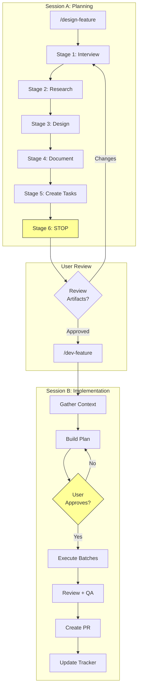
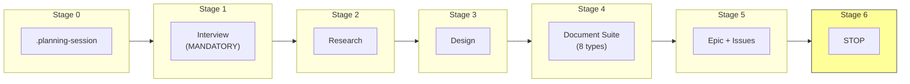
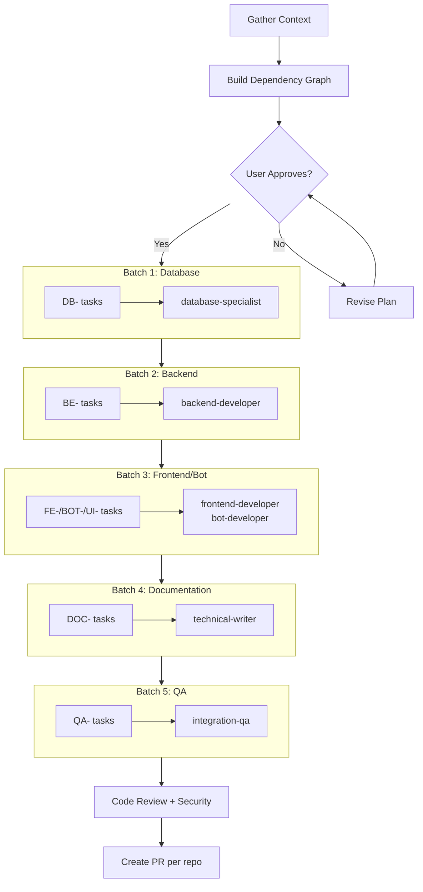
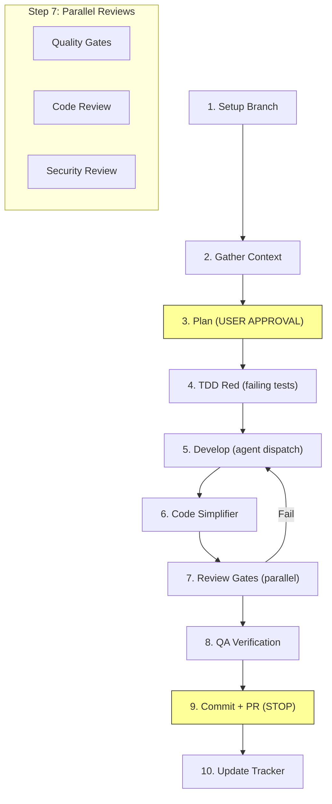
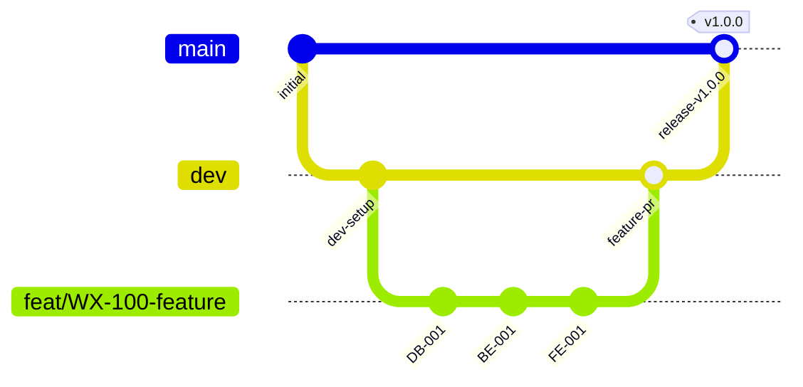
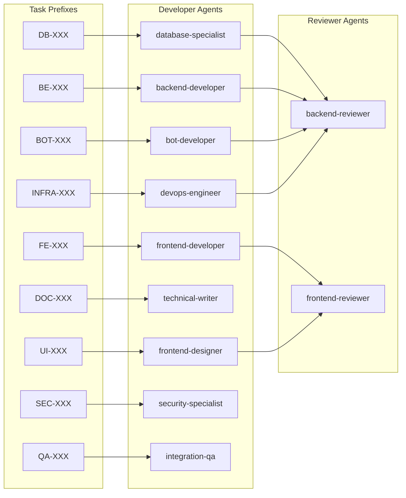
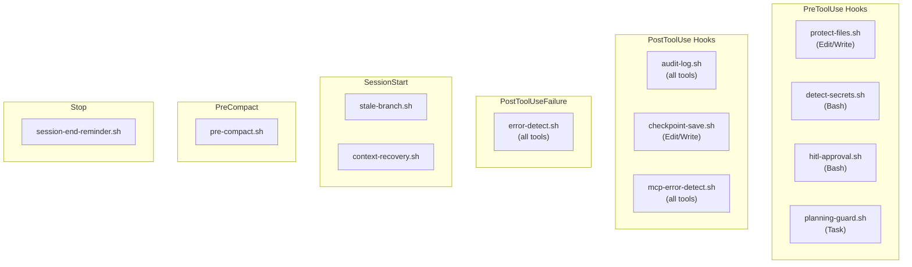
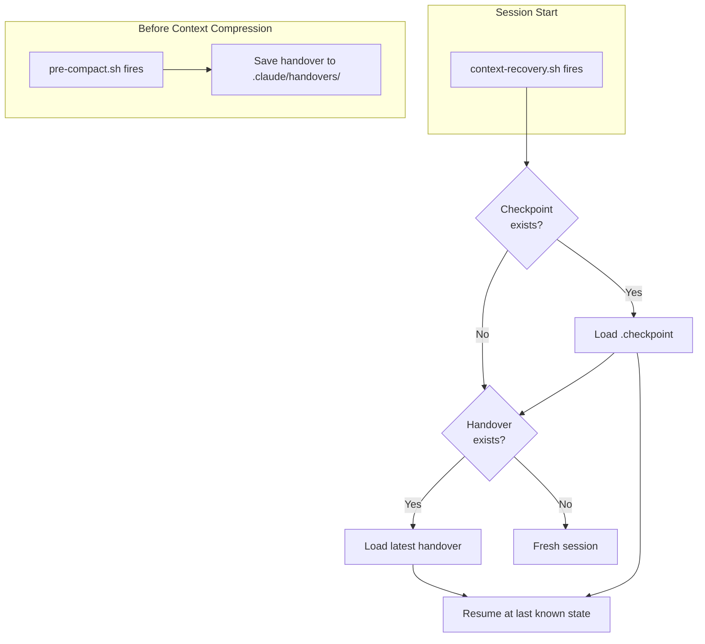

# Weather Platform Development Workflow Diagrams

Visual reference for the development workflow (v2.0.0).

---

## 1. Two-Session Development Flow

---

## 2. Design-Feature: 6 Phases

---

## 3. Develop-Feature: Batch Execution

---

## 4. Develop-Task: 10-Step TDD

---

## 5. Branch Hierarchy

---

## 6. Agent Assignment

---

## 7. Hook Architecture

---

## 8. Context Recovery Flow

---

**Version**: 2.0.0
**Template**: Workflow Diagrams
